---

excalidraw-plugin: parsed
tags: [excalidraw]

---
==⚠ Switch to EXCALIDRAW VIEW in the MORE OPTIONS menu of this document. ⚠== You can decompress Drawing data with the command palette: 'Decompress current Excalidraw file'. For more info check in plugin settings under 'Saving'

# Multi-Dictate: Intelligent Speech-to-Text Processing System

## Core System Architecture


## End-to-End Data Flow

```mermaid
flowchart LR
    subgraph "🎤 CAPTURE"
        A1[Microphone<br/>48kHz 16-bit] --> A2[PulseAudio<br/>Audio Stream]
        A2 --> A3[Voice Activity Detection<br/>VAD]
    end

    subgraph "🧠 TRANSCRIPTION"
        B1[Audio Segments<br/>2s chunks] --> B2[Google Speech API<br/>Recognition]
        B2 --> B3[Raw Text Output<br/>UTF-8]
    end

    subgraph "⚡ OPTIMIZATION"
        C1[Intent Analysis<br/>NLP Processing] --> C2[Context Injection<br/>RAG + Files]
        C2 --> C3[Prompt Engineering<br/>9-Stage Pipeline]
    end

    subgraph "🤖 AI PROCESSING"
        D1[Model Selection<br/>Smart Router] --> D2[AI Processing<br/>Qwen/OpenAI/Gemini]
        D2 --> D3[Response Quality<br/>Scoring]
    end

    subgraph "📤 OUTPUT"
        E1[Format Output<br/>Text/Speech] --> E2[Multi-Modal Delivery<br/>Multiple Channels]
        E2 --> E3[User Interface<br/>Visual/Audio]
    end

    A3 --> B1
    B3 --> C1
    C3 --> D1
    D3 --> E1

    style A1 fill:#e3f2fd
    style B1 fill:#f3e5f5
    style C1 fill:#e8f5e8
    style D1 fill:#fff3e0
    style E1 fill:#fce4ec
```



## Module Dependency Graph


## 9-Stage Prompt Pipeline

```mermaid
flowchart TD
    subgraph "STAGE 1-3: INPUT ANALYSIS"
        S1[📝 Raw Intent Capture<br/>Text Analysis<br/>Language Detection<br/>Ambiguity Score]
        S2[🎯 Intent Clarification<br/>Task Type ID<br/>Domain Context<br/>Complexity Level]
        S3[⚙️ Constraint Extraction<br/>Tech Stack<br/>Requirements<br/>Preferences]
    end

    subgraph "STAGE 4-6: CONTEXT ENRICHMENT"
        S4[📚 Context Injection<br/>RAG System<br/>File Context<br/>Project Data]
        S5[🏗️ Skeleton Selection<br/>Debug Solve<br/>Optimize Analyze<br/>Plan Execute]
        S6[👨‍💻 Instruction Engineering<br/>Role Definition<br/>Reasoning Style<br/>Safety Guidelines]
    end

    subgraph "STAGE 7-9: OUTPUT SPECIFICATION"
        S7[📋 Output Specification<br/>Format Design<br/>Verbosity Level<br/>Structure Plan]
        S8[✅ Quality Gate<br/>6-Dimension Scoring<br/>90/100 Validation<br/>Quality Check]
        S9[🔄 Feedback Loop<br/>Success Tracking<br/>Model Selection<br/>Continuous Learning]
    end

    S1 --> S2 --> S3
    S3 --> S4 --> S5 --> S6
    S6 --> S7 --> S8 --> S9

    style S1 fill:#e3f2fd
    style S2 fill:#e3f2fd
    style S3 fill:#e3f2fd
    style S4 fill:#e8f5e8
    style S5 fill:#e8f5e8
    style S6 fill:#e8f5e8
    style S7 fill:#fff3e0
    style S8 fill:#fff3e0
    style S9 fill:#fff3e0
```



## AI Model Ecosystem

```mermaid
graph TB
    subgraph "SMART ROUTER"
        ROUTER[AI Smart Router<br/>Load Balancing<br/>Model Selection<br/>Performance Tracking]
    end

    subgraph "LOCAL MODELS"
        LOCAL[🏠 Qwen Local Models<br/><br/>• 7B Turbo (Fast)<br/>• 14B Plus (Medium)<br/>• 72B Max (Expert)<br/><br/>Ollama Backend<br/>Offline Capability]
    end

    subgraph "CLOUD MODELS"
        CLOUD[☁️ Cloud AI Services<br/><br/>• OpenAI GPT-4/4-Turbo<br/>  - 4K/32K Context<br/>  - High Quality<br/>• Google Gemini Pro<br/>  - 32K Context<br/>  - Advanced Logic<br/>  - Multi-modal]
    end

    subgraph "SPECIALIZED PROCESSORS"
        SPECIAL[🔧 Specialized Processors<br/><br/>• Problem Solver<br/>  - RAG Enhanced<br/>  - Domain Expert<br/>• Context Processor<br/>  - File Integration<br/>• Quality Optimizer<br/>  - Continuous Learning]
    end

    subgraph "SELECTION CRITERIA"
        CRITERIA[🎯 Selection Criteria<br/><br/>• Task Complexity<br/>• Context Size<br/>• Latency Requirements<br/>• Quality Threshold<br/>• Cost Efficiency<br/>• Privacy Needs]
    end

    ROUTER --> LOCAL
    ROUTER --> CLOUD
    ROUTER --> SPECIAL
    CRITERIA --> ROUTER

    style ROUTER fill:#ff9800
    style LOCAL fill:#4caf50
    style CLOUD fill:#2196f3
    style SPECIAL fill:#9c27b0
    style CRITERIA fill:#ff5722
```

## Configuration & Control System

```mermaid
graph LR
    subgraph "CONFIGURATION FILES"
        CONFIG1[📄 dictate.yaml<br/>Main System Settings]
        CONFIG2[📄 keyboard.yaml<br/>Layout & Keybindings]
        CONFIG3[📄 ai_success.json<br/>Model Performance]
        CONFIG4[📄 references/*.json<br/>Domain Templates]
    end

    subgraph "CONTROL INTERFACES"
        CONTROL1[🎹 Keyboard Shortcuts<br/>Super+F9-12<br/>Ctrl+Shift+S]
        CONTROL2[📋 FIFO Interface<br/>/tmp/dictate<br/>Command System]
        CONTROL3[🔧 System Service<br/>systemctl --user<br/>dictate.service]
        CONTROL4[🌐 Web Interface<br/>HTTP API<br/>Firefox Extension]
    end

    subgraph "MONITORING"
        MONITOR1[📊 Performance Metrics<br/>Real-time Stats]
        MONITOR2[🔍 Health Checks<br/>System Diagnostics]
        MONITOR3[📝 Logging<br/>Journalctl<br/>Debug Output]
    end

    CONFIG1 --> CONTROL1
    CONFIG2 --> CONTROL1
    CONFIG3 --> CONTROL2
    CONFIG4 --> CONTROL3

    CONTROL1 --> MONITOR1
    CONTROL2 --> MONITOR2
    CONTROL3 --> MONITOR3
    CONTROL4 --> MONITOR1

    style CONFIG1 fill:#e3f2fd
    style CONTROL1 fill:#e8f5e8
    style MONITOR1 fill:#fff3e0
```



## Performance Monitoring Dashboard

```mermaid
graph TB
    subgraph "📊 REAL-TIME METRICS"
        METRICS[Performance Dashboard<br/>Live Monitoring]
    end

    subgraph "🎤 AUDIO PERFORMANCE"
        AUDIO_METRICS[Audio Metrics<br/><br/>• Latency: &lt;100ms<br/>• Sample Rate: 48kHz<br/>• VAD Accuracy: 95%<br/>• Buffer Health: 98%]
    end

    subgraph "🧠 PROCESSING METRICS"
        PROCESS_METRICS[Processing Metrics<br/><br/>• Pipeline: &lt;10ms<br/>• Quality Score: 90/100<br/>• Model Selection: Optimal<br/>• Throughput: High]
    end

    subgraph "📤 OUTPUT QUALITY"
        OUTPUT_METRICS[Output Quality<br/><br/>• WPM: 200+<br/>• Accuracy: 98%<br/>• Error Rate: &lt;2%<br/>• User Satisfaction: 95%]
    end

    subgraph "🔧 SYSTEM HEALTH"
        SYSTEM_METRICS[System Health<br/><br/>• CPU Usage: 30%<br/>• Memory: 2GB<br/>• Disk I/O: Normal<br/>• Network: Stable]
    end

    METRICS --> AUDIO_METRICS
    METRICS --> PROCESS_METRICS
    METRICS --> OUTPUT_METRICS
    METRICS --> SYSTEM_METRICS

    style METRICS fill:#ff9800
    style AUDIO_METRICS fill:#2196f3
    style PROCESS_METRICS fill:#4caf50
    style OUTPUT_METRICS fill:#9c27b0
    style SYSTEM_METRICS fill:#ff5722
```



## Development & Testing Workflow

```mermaid
flowchart LR
    subgraph "📝 DEVELOPMENT"
        DEV1[Code Development<br/>Python 3.8+]
        DEV2[Feature Implementation<br/>Module Design]
        DEV3[Code Review<br/>Quality Assurance]
    end

    subgraph "🧪 TESTING"
        TEST1[Unit Tests<br/>test_dictate_unit.py]
        TEST2[Integration Tests<br/>wrapping_test_dictate.py]
        TEST3[Manual Tests<br/>test_dictate.py]
        TEST4[Benchmarks<br/>optimization_benchmark.py]
    end

    subgraph "🔍 QUALITY"
        QUALITY1[Linting<br/>pylint/flake8]
        QUALITY2[Coverage Report<br/>make test-coverage]
        QUALITY3[Health Checks<br/>System Diagnostics]
    end

    subgraph "🚀 DEPLOYMENT"
        DEPLOY1[Build & Package<br/>make build]
        DEPLOY2[Installation<br/>./install.sh]
        DEPLOY3[System Integration<br/>Service Setup]
        DEPLOY4[Monitoring<br/>Performance Track]
    end

    DEV1 --> DEV2 --> DEV3
    DEV3 --> TEST1
    TEST1 --> TEST2 --> TEST3 --> TEST4
    TEST4 --> QUALITY1 --> QUALITY2 --> QUALITY3
    QUALITY3 --> DEPLOY1 --> DEPLOY2 --> DEPLOY3 --> DEPLOY4

    style DEV1 fill:#e3f2fd
    style TEST1 fill:#e8f5e8
    style QUALITY1 fill:#fff3e0
    style DEPLOY1 fill:#f3e5f5
```



## Quick Reference Commands

### Development & Testing
```bash
# Run from source
./run_dictate.py

# Run all tests
pytest

# Linting & validation
make check

# Coverage report
make test-coverage
```

### Installation & Service Management
```bash
# System installation
./install.sh

# Complete removal
./uninstall.sh

# Service control
systemctl --user start dictate.service
systemctl --user status dictate.service
systemctl --user restart dictate.service

# View logs
journalctl --user -u dictate.service -f
```

### Prompt Optimization
```bash
# Quick optimization with context
python3 optimize.py "fix slow api" --clipboard "/var/www/app"

# Optimization without context
python3 optimize.py "plan microservices migration" --no-context

# Full AI response with Qwen
python3 qwen_optimize.py prompt "debug authentication issue" --clipboard "/app/auth"

# Use different model
python3 qwen_optimize.py prompt "optimize database queries" --model qwen-plus

# Quick mode
python3 qwen_optimize.py prompt "fix memory leak" --quick

# Optimization only
python3 qwen_optimize.py prompt "create api documentation" --optimize-only
```

### System Control
```bash
# FIFO control
echo "start" > /tmp/dictate
echo "stop" > /tmp/dictate
echo "toggle" > /tmp/dictate
echo "status" > /tmp/dictate

# Interactive testing
python3 qwen_optimize.py interactive

# Test predefined cases
python3 qwen_optimize.py test

# Check available models
python3 qwen_optimize.py models

# Health check
python3 test_optimization.py --mode health
```

## Excalidraw Drawing

```compressed-json
N4KAkARALgngDgUwgLgAQQQDwMYEMA2AlgCYBOuA7hADTgQBuCpAzoQPYB2KqATLZMzYBXUtiRoIACyhQ4zZAHoFAc0JRJQgEYA6bGwC2CgF7N6hbEcK4OCtptbErHALRY8RMpWdx8Q1TdIEfARcZgRmBShcZQUebQBGAA5tAAYaOiCEfQQOKGZuAG1wMFAwMogSbggAcQApACEAYQAJOB4hAHUAZXiu0g6ADQAtfQArBAA2HnSyyFhEKsDsKI5l
YJnyzG5nABYUif5ymG2AZh347R54lIBOE4B2AFZDyAoSdW4dm52XqQRCZTSbhXeK/axrcSoFK/ZhQUhsADWCEabHwbFIVQAxPEEDicRtIJpcNgEcp4UIOMQUWiMRI4dZmHBcIFcgSIAAzQj4fBdWDrCSCDxs2HwpEdd6SYEwuGIhC8mD89CCyq/cmAjjhfJoUHFSBsJnYNTHbUpaG6iBk4RwACSxC1qAKAF1fuzyNlbdwOEJub9CJSsFVcGlVcJK
RrmPbSrNoPBISddQBfGEIBDEbhnFInG6JRKZ36MFjsLjag7mgusTgAOU4Ym4iXi9wm8R2uZOvuYABFMlBU9x2QQwr9NKHiABRYLZXL2r0+81CODEXA9tPaxuPCYpR7NlJXZ7mogcBGe734X5okm9tD9/BhYoJ8DOui4OBwXlLyFR6CSLKQiBEQFQBsDCEAgFD1MSpLkpS1Loli7LwQhQHYCILJQNaPb6LyorIqisESNiuKEUhKE5GhGHgSSloUlS
uG0ug9IcIyzKkcRpCoehWQAGJcjyfK/sqaaHBAyFsaRHGYTKYoSlKxTCSRuTiVhsryoqEACax7EYQASsI6qatwOrlCJmlZAA8gaRoGaaQnGWJGGcZwUCcbg+hcsaqB7kZ8lkVxjldIQRiQjwZpeaJCkYQAKlgUAAIL/sW6DBOygE2d5ilRKQsVsWwFDfrgK6oDOp6ybZ4VZKOlIxdluUhAVEDMvCVCpWFPn6FVjURbGiwjhpdlcW6CA6YqRVCcw2
DwtyAzcPc9w3KN42ovgACanzrto9yJDc+w8J5kBGGwBjcFGkD0AQQiQvEd7NSZ+g6dR4b2hAUGCbJZIkP5gXAiFkBvcQvIIHA3C7RapAkAAsmwxAIBVuCaMEBXXoOr2gzRNJHea9SonVpDKESAAUVz3NQvANsThPEyk2iPAAlGyWkIMo3rMosuO4ATJzQrwHNk9zUJU7TV0ld5SlIuZUBFtOJ5Ca6LmDTkUOg6s6PRjksPw9wcLnb82BEIDaCawg
vwcLLGukFr5rCFAB6Qgbvz6MySKkJWJv62bhvmvbpCOzDcOXqgBuC+UdjjMszBdMbcAQ1DPvq1eA7u+UxLi4wEUHfgyvlPM/GZMsRZsshsIGJ1CxoCN+5sBeCPxy68KYTn4ucH21f7qEsW5ynafHtygeQI4zBqzhuTRWDORCE3N4IOASZ0JywSRveCZAA===
```
%%