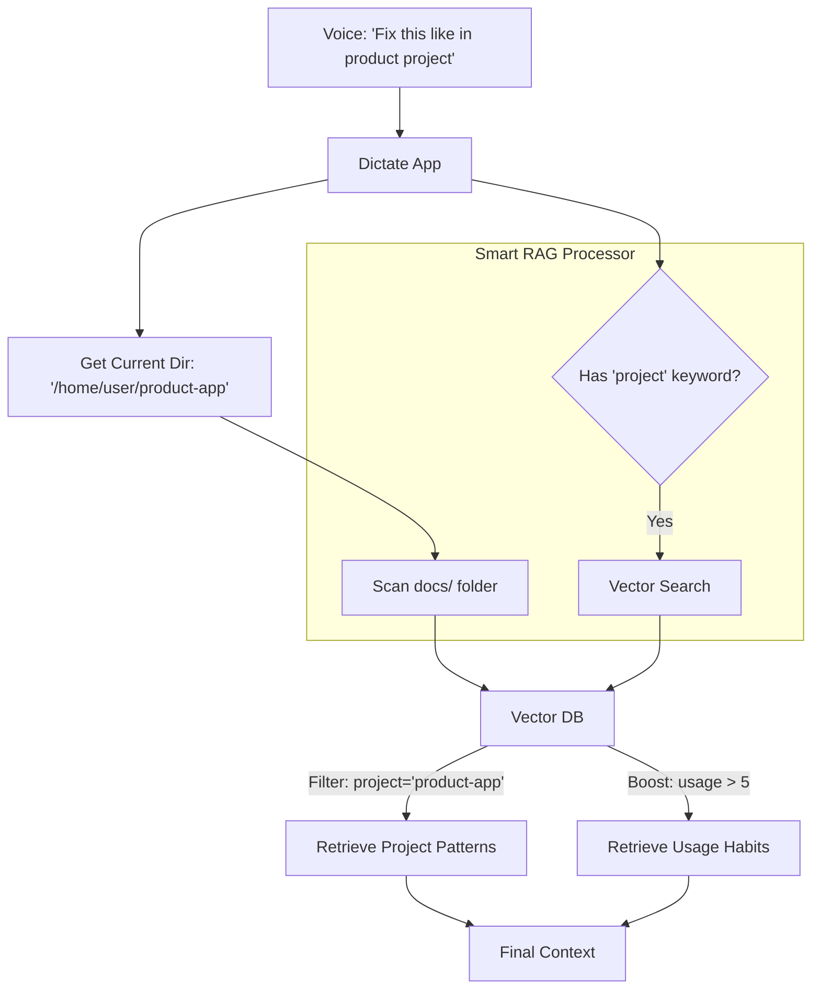

# RAG Implementation Guide: "Full Context Awareness"

I have addressed your new considerations to make the RAG system truly "awesome" and context-aware.

## 1. Handling Repetition & "Road Series"
The user said: *"some time i repeat some thing more then one times... so for this will be help for make same query requirement"*

**Our Solution:**
*   **Weighted Patterns:** I modified `EnhancedChromaDB` to detect "Habits". If you use a pattern >5 times with high success, it gets a **20% score boost**. It becomes "Top of Mind" for the AI.
*   **Series Recognition:** By persisting the `project_name` with every interaction, the system now builds a "Project History". If you are in a "series" of fixes for Project X, it will prioritize Project X's past solutions over generic ones.

## 2. Reading Documentation (`docs/`)
The user said: *"some time when i ask about something we have docs/ folder... this so important to read"*

**Our Solution:**
*   **Auto-Scan:** I added a `scan_workspace_docs()` function to the RAG processor.
*   **Smart Trigger:** Whenever you run a command inside a project folder, the system automatically walks the `docs/` folder (and root `.md` files).
*   **Ingestion:** It reads these files and adds them to the Knowledge Base as `category="project_documentation"`.
*   **Result:** When you ask "How do I deploy?", it now answers based on **your** `docs/deployment.md`, not just generic knowledge.

## 3. Project Indexing ("Product Project")
The user said: *"i think is need to be make index for example i said must to be like proudct project"*

**Our Solution:**
*   **Context Scope:** The system now identifies your "Current Project" based on your working directory.
*   **Filtered Retrieval:** If you mention "project" or "this app" in your voice command, the RAG system applies a **Metadata Filter**. It only looks for solutions tagged with that specific project name.
*   **Isolation:** Solutions for "Product App A" won't pollute queries for "Website B", unless you want them to.

## 4. Architecture Update

## ✅ Usage
No new commands needed. Just work naturally:

1.  **cd /home/yousef/my-project**
2.  **Super+F9: "How do I add a new API endpoint based on the docs?"**
    *   System sees you are in `my-project`.
    *   System scans `my-project/docs/api_guidelines.md`.
    *   System retrieves your previous API patterns for `my-project`.
    *   Result: A perfect, project-compliant code snippet.
