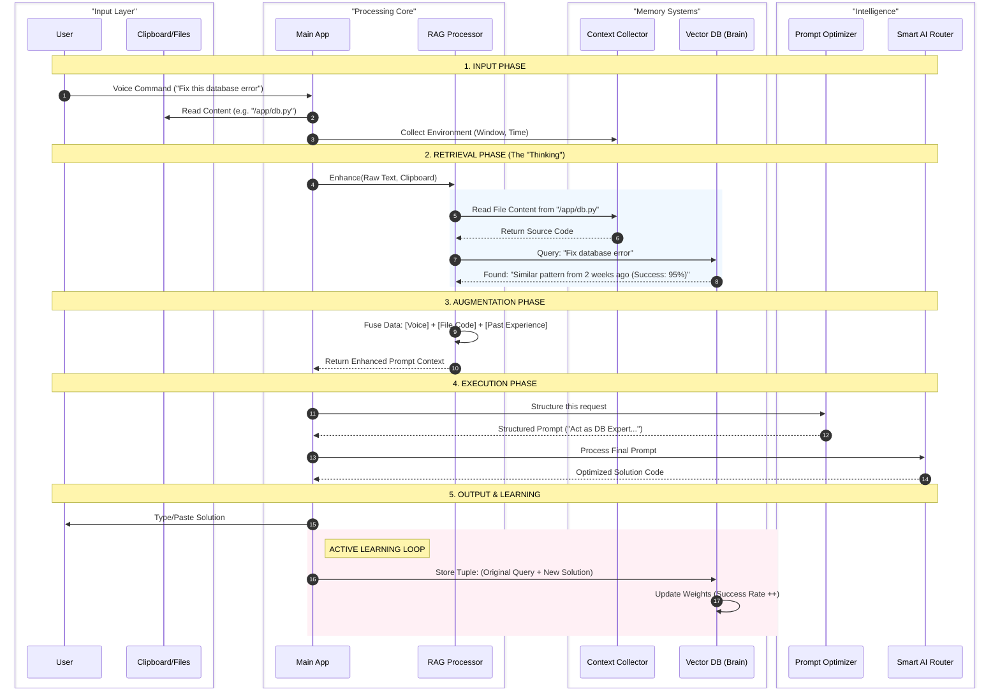

# 🧠 Multi-Dictate RAG System Flow

This diagram illustrates exactly how your voice, clipboard, and the AI's "Brain" (Vector DB) interact to produce intelligent results and learn over time.

## 🔍 How to Read This Diagram

1.  **Input Layer**: Where you start. You provide the intent (voice) and the subject (clipboard file path).
2.  **Retrieval Phase (The "Magic")**: Before doing anything, the system checks its "Brain" (ChromaDB). It asks: *"Have I seen this problem before?"* and *"Let me read the file you mentioned."*
3.  **Augmentation**: It combines your simple command with the massive context it just found.
4.  **Learning Loop (Pink Area)**: This is crucial. Once the AI gives a solution, the system **automatically saves it**. Next time, it remembers this solution, making it smarter every single time you use it.
