# Multi-Dictate System Architecture & Flowcharts

> 🎯 **Complete Visual Documentation of the Multi-Dictate Intelligent Speech-to-Text Processing System**

---

## 📋 Table of Contents

1. [System Overview Architecture](#-system-overview-architecture)
2. [End-to-End Data Processing Pipeline](#-end-to-end-data-processing-pipeline)
3. [Module Dependency Structure](#-module-dependency-structure)
4. [9-Stage Prompt Optimization Pipeline](#-9-stage-prompt-optimization-pipeline)
5. [AI Model Ecosystem Integration](#-ai-model-ecosystem-integration)
6. [Configuration Management System](#-configuration-management-system)
7. [Real-Time Performance Monitoring](#-real-time-performance-monitoring)
8. [Development & Testing Lifecycle](#-development--testing-lifecycle)
9. [Quality Assurance Framework](#-quality-assurance-framework)
10. [Deployment & Scaling Architecture](#-deployment--scaling-architecture)

---

## 🏗️ System Overview Architecture

### Core System Components & Data Flow

```mermaid
graph TB
    subgraph "🎤 INPUT ACQUISITION LAYER"
        A1[🎙️ Microphone Capture<br/>48kHz, 16-bit, Stereo<br/>Low-Latency Buffer]
        A2[⌨️ Keyboard Input<br/>F9 Hotkey<br/>Custom Shortcuts]
        A3[📱 Remote Input<br/>Mobile App<br/>Web Interface]
    end

    subgraph "🔍 PRE-PROCESSING LAYER"
        B1[🌊 Audio Preprocessing<br/>Noise Reduction<br/>Echo Cancellation<br/>Automatic Gain Control]
        B2[🎯 Voice Activity Detection<br/>webrtcvad<br/>Silence Removal<br/>Speech Segmentation]
        B3[📝 Text Normalization<br/>Unicode Processing<br/>Layout Detection<br/>Character Mapping]
    end

    subgraph "🧠 CORE INTELLIGENCE LAYER"
        C1[🗣️ Speech Recognition<br/>Google Speech API<br/>Multiple Languages<br/>Context-Aware]
        C2[🔄 9-Stage Pipeline<br/>Intent Analysis<br/>Context Injection<br/>Quality Optimization]
        C3[🤖 AI Router Engine<br/>Load Balancing<br/>Model Selection<br/>Performance Tracking]
        C4[✅ Quality Assurance<br/>Real-time Scoring<br/>Error Detection<br/>Continuous Learning]
    end

    subgraph "🎨 OUTPUT GENERATION LAYER"
        D1[⌨️ Keyboard Automation<br/>pyautogui Integration<br/>Typing Simulation<br/>App-Specific Input]
        D2[🔊 Audio Feedback<br/>gTTS Synthesis<br/>Natural Voices<br/>Multiple Languages]
        D3[👁️ Visual Interface<br/>Status Indicators<br/>Real-time Feedback<br/>Progress Tracking]
        D4[📋 Clipboard Management<br/>Copy/Paste Operations<br/>Format Preservation<br/>Rich Content Support]
    end

    subgraph "🔧 SUPPORTING INFRASTRUCTURE"
        E1[💾 Vector Database<br/>ChromaDB Storage<br/>Semantic Search<br/>Context Memory]
        E2[📚 Knowledge Base<br/>Domain Templates<br/>Context References<br/>Expert Systems]
        E3[⚙️ Configuration Manager<br/>YAML Settings<br/>Runtime Parameters<br/>User Preferences]
        E4[📊 Analytics Engine<br/>Performance Metrics<br/>Usage Statistics<br/>Quality Reports]
    end

    %% Input Connections
    A1 --> B1
    A2 --> B3
    A3 --> B2

    %% Pre-processing to Core
    B1 --> B2
    B2 --> C1
    B3 --> C2

    %% Core Processing Flow
    C1 --> C2
    C2 --> C3
    C3 --> C4

    %% Output Generation
    C4 --> D1
    C4 --> D2
    C4 --> D3
    C4 --> D4

    %% Infrastructure Support
    E1 --> C2
    E2 --> C2
    E3 --> C3
    E4 --> C4

    %% Styling
    classDef inputLayer fill:#e3f2fd,stroke:#1976d2,stroke-width:2px
    classDef preprocessLayer fill:#f3e5f5,stroke:#7b1fa2,stroke-width:2px
    classDef coreLayer fill:#e8f5e8,stroke:#388e3c,stroke-width:2px
    classDef outputLayer fill:#fff3e0,stroke:#f57c00,stroke-width:2px
    classDef infraLayer fill:#fce4ec,stroke:#c2185b,stroke-width:2px

    class A1,A2,A3 inputLayer
    class B1,B2,B3 preprocessLayer
    class C1,C2,C3,C4 coreLayer
    class D1,D2,D3,D4 outputLayer
    class E1,E2,E3,E4 infraLayer
```



**📝 Description:** This architecture diagram illustrates the complete multi-dictate system from input acquisition through output generation. The system is organized into five distinct layers, each with specific responsibilities and interfaces. The flow moves from left to right, with supporting infrastructure providing essential services across all layers.

---

## 🚀 End-to-End Data Processing Pipeline

### Real-Time Processing Flow


**📝 Description:** The data processing pipeline shows the complete journey of audio data from capture to delivery. Each phase consists of multiple processing steps with feedback loops for continuous improvement. The pipeline is designed for real-time operation with parallel processing capabilities and quality assurance at each stage.

---

## 📦 Module Dependency Structure

### Code Architecture & Component Relationships


**📝 Description:** This dependency graph illustrates the modular architecture of the multi-dictate system. Each module has clearly defined responsibilities and interfaces. The main orchestrator coordinates all modules, while utility modules provide cross-cutting concerns. Testing modules validate the functionality and performance of the entire system.

---

## 🔧 9-Stage Prompt Optimization Pipeline

### Advanced Prompt Engineering Workflow

```mermaid
flowchart TD
    subgraph "📝 STAGE 1-3: INPUT ANALYSIS & FOUNDATION"
        S1[Stage 1: Raw Intent Capture<br/>🎯 Text Analysis<br/>🌍 Language Detection<br/>❓ Ambiguity Scoring]

        S2[Stage 2: Intent Clarification<br/>📋 Task Type Identification<br/>🏢 Domain Context Mapping<br/>📊 Complexity Assessment]

        S3[Stage 3: Constraint Extraction<br/>⚙️ Technical Stack Analysis<br/>📝 Requirements Definition<br/>🎨 User Preferences]
    end

    subgraph "📚 STAGE 4-6: CONTEXT ENRICHMENT & STRUCTURING"
        S4[Stage 4: Context Injection<br/>🔍 RAG System Integration<br/>📁 File Context Analysis<br/>🗄️ Project Data Retrieval]

        S5[Stage 5: Skeleton Selection<br/>🏗️ Template Matching<br/>📐 Structure Planning<br/>🎭 Role Definition]

        S6[Stage 6: Instruction Engineering<br/>👤 Persona Development<br/>🧠 Reasoning Style<br/>🛡️ Safety Guidelines]
    end

    subgraph "📋 STAGE 7-9: OUTPUT SPECIFICATION & QUALITY"
        S7[Stage 7: Output Specification<br/>📄 Format Design<br/>📏 Verbosity Control<br/>🏗️ Structure Planning]

        S8[Stage 8: Quality Gate<br/>✅ 6-Dimension Scoring<br/>🎯 90/100 Threshold<br/>🔍 Validation Checks]

        S9[Stage 9: Feedback Loop<br/>📈 Success Tracking<br/>🎛️ Model Selection<br/>🔄 Continuous Learning]
    end

    subgraph "🎯 PIPELINE CONTROLS"
        C1[Quality Metrics<br/>Clarity, Specificity<br/>Contextualization<br/>Actionability]
        C2[Performance Targets<br/>Processing Time<br/>Success Rate<br/>User Satisfaction]
        C3[Adaptive Tuning<br/>Learning Algorithms<br/>A/B Testing<br/>Optimization Rules]
    end

    %% Sequential Flow
    S1 --> S2 --> S3
    S3 --> S4 --> S5 --> S6
    S6 --> S7 --> S8 --> S9

    %% Quality Control Integration
    C1 -.-> S3
    C1 -.-> S6
    C1 -.-> S8

    %% Adaptive Feedback
    C2 -.-> S5
    C3 -.-> S1
    S9 -.-> C3
    S8 -.-> C2

    %% Parallel Processing Paths
    S4 -.-> S5
    S5 -.-> S6

    %% Styling
    classDef inputStage fill:#e3f2fd,stroke:#0277bd,color:#0277bd
    classDef contextStage fill:#e8f5e8,stroke:#2e7d32,color:#2e7d32
    classDef outputStage fill:#fff3e0,stroke:#ef6c00,color:#ef6c00
    classDef controls fill:#fce4ec,stroke:#ad1457,color:#ad1457

    class S1,S2,S3 inputStage
    class S4,S5,S6 contextStage
    class S7,S8,S9 outputStage
    class C1,C2,C3 controls
```



**📝 Description:** The 9-stage prompt optimization pipeline represents the core intelligence of the multi-dictate system. It transforms raw user input into highly optimized prompts through systematic analysis, context enrichment, and quality validation. Each stage builds upon the previous one, with adaptive controls ensuring continuous improvement and quality consistency.

---

## 🤖 AI Model Ecosystem Integration

### Multi-Model Architecture & Smart Routing

```mermaid
graph TB
    subgraph "🎛️ SMART ROUTING CORE"
        ROUTER[AI Smart Router<br/>Intelligent Selection Engine<br/>Performance-Based Routing<br/>Adaptive Load Balancing]
    end

    subgraph "🏠 LOCAL AI MODELS"
        LOCAL_QWEN[Qwen Local Models<br/><br/>🚀 Qwen-Turbo (7B)<br/>• Ultra-Fast Response<br/>• 8K Context Window<br/>• Local Processing<br/><br/>⚡ Qwen-Plus (14B)<br/>• Balanced Performance<br/>• 32K Context Window<br/>• Enhanced Reasoning<br/><br/>🧠 Qwen-Max (72B)<br/>• Expert-Level Performance<br/>• 32K Context Window<br/>• Complex Problem Solving]
    end

    subgraph "☁️ CLOUD AI SERVICES"
        CLOUD_MODELS[Cloud AI Services<br/><br/>🔷 OpenAI GPT-4<br/>• 4K/32K Context<br/>• High Accuracy<br/>• API Integration<br/><br/>🔷 Google Gemini Pro<br/>• 32K Context<br/>• Multimodal Support<br/>• Advanced Logic<br/><br/>🔷 Claude API<br/>• Large Context<br/>• Safety-First<br/>• Detailed Reasoning]
    end

    subgraph "🎯 SPECIALIZED PROCESSORS"
        SPECIALIZED[Specialized AI Processors<br/><br/>🔧 Problem Solver<br/>• RAG-Enhanced<br/>• Domain Expert<br/>• Complex Reasoning<br/><br/>📚 Context Processor<br/>• File Integration<br/>• Semantic Understanding<br/>• Knowledge Retrieval<br/><br/>✨ Quality Optimizer<br/>• Continuous Learning<br/>• Performance Tracking<br/>• Model Fine-Tuning]
    end

    subgraph "📊 SELECTION CRITERIA ENGINE"
        CRITERIA[Model Selection Criteria<br/><br/>🎯 Task Complexity<br/>Simple → Medium → Complex<br/><br/>📏 Context Requirements<br/>Short → Medium → Long<br/><br/>⏱️ Latency Constraints<br/>Real-Time → Normal → Batch<br/><br/>💰 Cost Efficiency<br/>Free → Standard → Premium<br/><br/>🔒 Privacy Requirements<br/>Public → Sensitive → Private<br/><br/>📈 Quality Threshold<br/>Basic → Standard → Premium]
    end

    subgraph "🔄 PERFORMANCE MONITORING"
        MONITOR[Performance Monitoring<br/><br/>📊 Real-Time Metrics<br/>• Response Time<br/>• Success Rate<br/>• Error Tracking<br/><br/>📈 Historical Analytics<br/>• Model Performance<br/>• Usage Patterns<br/>• Cost Analysis<br/><br/>🎯 Quality Assurance<br/>• Output Scoring<br/>• User Feedback<br/>• Continuous Improvement]
    end

    %% Routing Connections
    ROUTER --> LOCAL_QWEN
    ROUTER --> CLOUD_MODELS
    ROUTER --> SPECIALIZED

    %% Criteria Integration
    CRITERIA --> ROUTER
    MONITOR --> ROUTER

    %% Feedback Loops
    LOCAL_QWEN --> MONITOR
    CLOUD_MODELS --> MONITOR
    SPECIALIZED --> MONITOR
    MONITOR -.-> CRITERIA

    %% Styling
    classDef routerCore fill:#ff6b35,stroke:#d84315,color:#ffffff
    classDef localModels fill:#4caf50,stroke:#2e7d32,color:#ffffff
    classDef cloudModels fill:#2196f3,stroke:#1565c0,color:#ffffff
    classDef specialized fill:#9c27b0,stroke:#6a1b9a,color:#ffffff
    classDef criteria fill:#ff9800,stroke:#ef6c00,color:#ffffff
    classDef monitor fill:#607d8b,stroke:#37474f,color:#ffffff

    class ROUTER routerCore
    class LOCAL_QWEN localModels
    class CLOUD_MODELS cloudModels
    class SPECIALIZED specialized
    class CRITERIA criteria
    class MONITOR monitor
```

**📝 Description:** The AI Model Ecosystem showcases a sophisticated multi-model architecture with intelligent routing capabilities. The system seamlessly integrates local models for privacy and speed, cloud models for advanced capabilities, and specialized processors for domain-specific tasks. Smart routing ensures optimal model selection based on task requirements, performance metrics, and user preferences.

---

## ⚙️ Configuration Management System

### Settings, Preferences & Control Interfaces

```mermaid
graph LR
    subgraph "📄 CONFIGURATION FILES"
        CONFIG1[dictate.yaml<br/>🎛️ Core System Settings<br/>• Audio Configuration<br/>• Model Selection<br/>• Performance Tuning<br/>• Feature Flags]

        CONFIG2[keyboard.yaml<br/>⌨️ Input Configuration<br/>• Layout Detection<br/>• Key Bindings<br/>• Character Mapping<br/>• Custom Shortcuts]

        CONFIG3[ai_success.json<br/>📊 Performance Tracking<br/>• Model Success Rates<br/>• Response Quality<br/>• Usage Statistics<br/>• Cost Tracking]

        CONFIG4[references/<br/>📚 Template System<br/>• domain_references.json<br/>• page_templates.json<br/>• complex_scenarios.json<br/>• best_practices.json]
    end

    subgraph "🎛️ CONTROL INTERFACES"
        CONTROL1[Keyboard Shortcuts<br/>🎹 Direct Control<br/>• Super+F9: Start/Stop<br/>• Super+F10: Toggle<br/>• Super+F11: Settings<br/>• Ctrl+Shift+S: Status]

        CONTROL2[FIFO Interface<br/>📋 System Commands<br/>• /tmp/dictate<br/>• Real-time Control<br/>• State Management<br/>• Debug Interface]

        CONTROL3[System Service<br/>🔧 Service Management<br/>• systemctl --user<br/>• Auto-start Configuration<br/>• Process Monitoring<br/>• Log Management]

        CONTROL4[Web Interface<br/>🌐 Remote Control<br/>• HTTP API<br/>• Web Dashboard<br/>• Mobile Support<br/>• Browser Extension]
    end

    subgraph "🔍 MONITORING & LOGGING"
        MONITOR1[Performance Metrics<br/>📊 Real-time Monitoring<br/>• CPU/Memory Usage<br/>• Response Times<br/>• Error Rates<br/>• Quality Scores]

        MONITOR2[System Health<br/>🏥 Health Checks<br/>• Service Status<br/>• Dependency Health<br/>• Resource Availability<br/>• Network Connectivity]

        MONITOR3[Logging System<br/>📝 Comprehensive Logging<br/>• Debug Logs<br/>• Error Tracking<br/>• Performance Logs<br/>• User Activity]
    end

    subgraph "🔄 AUTOMATION WORKFLOWS"
        AUTO1[Configuration Sync<br/>🔄 Auto-Sync Settings<br/>• Cloud Backup<br/>• Multi-Device Sync<br/>• Version Control<br/>• Rollback Support]

        AUTO2[Adaptive Tuning<br/>⚡ Self-Optimization<br/>• Performance Tuning<br/>• Resource Allocation<br/>• Load Balancing<br/>• Quality Improvement]

        AUTO3[Maintenance Tasks<br/>🛠️ System Maintenance<br/>• Cache Cleanup<br/>• Log Rotation<br/>• Health Monitoring<br/>• Auto-Recovery]
    end

    %% Configuration to Control Flow
    CONFIG1 --> CONTROL1
    CONFIG2 --> CONTROL1
    CONFIG3 --> CONTROL2
    CONFIG4 --> CONTROL3

    %% Control to Monitoring Flow
    CONTROL1 --> MONITOR1
    CONTROL2 --> MONITOR2
    CONTROL3 --> MONITOR3
    CONTROL4 --> MONITOR1

    %% Automation Integration
    MONITOR1 --> AUTO1
    MONITOR2 --> AUTO2
    MONITOR3 --> AUTO3

    %% Feedback Loops
    AUTO1 -.-> CONFIG1
    AUTO2 -.-> CONFIG3
    AUTO3 -.-> MONITOR2

    %% Styling
    classDef configFiles fill:#e3f2fd,stroke:#0277bd,color:#0277bd
    classDef controlInterfaces fill:#e8f5e8,stroke:#2e7d32,color:#2e7d32
    classDef monitoring fill:#fff3e0,stroke:#ef6c00,color:#ef6c00
    classDef automation fill:#f3e5f5,stroke:#7b1fa2,color:#7b1fa2

    class CONFIG1,CONFIG2,CONFIG3,CONFIG4 configFiles
    class CONTROL1,CONTROL2,CONTROL3,CONTROL4 controlInterfaces
    class MONITOR1,MONITOR2,MONITOR3 monitoring
    class AUTO1,AUTO2,AUTO3 automation
```



**📝 Description:** The configuration management system provides comprehensive control over all aspects of the multi-dictate system. It includes multiple configuration file types, various control interfaces, extensive monitoring capabilities, and automation workflows for self-optimization and maintenance.

---

## 📊 Real-Time Performance Monitoring

### Live Dashboard & Quality Metrics

```mermaid
graph TB
    subgraph "🎯 CENTRAL DASHBOARD"
        DASHBOARD[Performance Dashboard<br/>📊 Real-Time Monitoring Center<br/>📈 Live Metrics Display<br/>🚨 Alert System<br/>📋 Historical Reports]
    end

    subgraph "🎤 AUDIO PERFORMANCE METRICS"
        AUDIO_METRICS[Audio Performance<br/><br/>⏱️ Latency: &lt;100ms<br/>🎵 Sample Rate: 48kHz<br/>🔍 VAD Accuracy: 95%<br/>💾 Buffer Health: 98%<br/>🎤 Signal Quality: 92%<br/>🔇 Noise Reduction: 85%]
    end

    subgraph "🧠 PROCESSING METRICS"
        PROCESS_METRICS[Processing Performance<br/><br/>⚡ Pipeline Speed: &lt;10ms<br/>🎯 Quality Score: 90/100<br/>🤖 Model Selection: Optimal<br/>📊 Throughput: 200 req/min<br/>🔄 Success Rate: 98%<br/>⚙️ CPU Usage: 30%]
    end

    subgraph "📤 OUTPUT QUALITY METRICS"
        OUTPUT_METRICS[Output Quality<br/><br/>⌨️ Typing Speed: 200+ WPM<br/>✅ Accuracy: 98%<br/>❌ Error Rate: &lt;2%<br/>😊 User Satisfaction: 95%<br/>🔊 Audio Quality: 92%<br/>📋 Format Preservation: 99%]
    end

    subgraph "🖥️ SYSTEM HEALTH METRICS"
        SYSTEM_METRICS[System Health<br/><br/>💾 Memory Usage: 2GB<br/>💿 Disk I/O: Normal<br/>🌐 Network: Stable<br/>🔌 Service Status: Active<br/>🔗 Dependencies: Healthy<br/>⚡ Power Efficiency: Optimal]
    end

    subgraph "📈 ANALYTICS & INSIGHTS"
        ANALYTICS[Analytics Engine<br/><br/>📊 Usage Statistics<br/>🎯 Performance Trends<br/>💰 Cost Analysis<br/>👤 User Behavior<br/>🔄 Improvement Suggestions<br/>📋 Quality Reports]
    end

    subgraph "🚨 ALERTING SYSTEM"
        ALERTS[Alert Management<br/><br/>🔴 Critical Alerts<br/>🟡 Warning Notifications<br/>🟢 Status Updates<br/>📧 Email Notifications<br/>📱 Push Alerts<br/>🔔 System Notifications]
    end

    %% Dashboard Connections
    DASHBOARD --> AUDIO_METRICS
    DASHBOARD --> PROCESS_METRICS
    DASHBOARD --> OUTPUT_METRICS
    DASHBOARD --> SYSTEM_METRICS

    %% Analytics Integration
    AUDIO_METRICS --> ANALYTICS
    PROCESS_METRICS --> ANALYTICS
    OUTPUT_METRICS --> ANALYTICS
    SYSTEM_METRICS --> ANALYTICS

    %% Alert System Integration
    ANALYTICS --> ALERTS
    AUDIO_METRICS -.-> ALERTS
    PROCESS_METRICS -.-> ALERTS
    OUTPUT_METRICS -.-> ALERTS
    SYSTEM_METRICS -.-> ALERTS

    %% Feedback Loops
    ALERTS -.-> DASHBOARD
    ANALYTICS -.-> DASHBOARD

    %% Styling
    classDef dashboard fill:#ff6b35,stroke:#d84315,color:#ffffff
    classDef audioMetrics fill:#42a5f5,stroke:#1565c0,color:#ffffff
    classDef processMetrics fill:#66bb6a,stroke:#2e7d32,color:#ffffff
    classDef outputMetrics fill:#ffa726,stroke:#ef6c00,color:#ffffff
    classDef systemMetrics fill:#ab47bc,stroke:#6a1b9a,color:#ffffff
    classDef analytics fill:#8d6e63,stroke:#5d4037,color:#ffffff
    classDef alerts fill:#ef5350,stroke:#c62828,color:#ffffff

    class DASHBOARD dashboard
    class AUDIO_METRICS audioMetrics
    class PROCESS_METRICS processMetrics
    class OUTPUT_METRICS outputMetrics
    class SYSTEM_METRICS systemMetrics
    class ANALYTICS analytics
    class ALERTS alerts
```



**📝 Description:** The real-time performance monitoring system provides comprehensive visibility into all aspects of the multi-dictate system. It includes specialized metrics for audio, processing, output quality, and system health, along with advanced analytics and intelligent alerting capabilities for proactive system management.

---

## 🧪 Development & Testing Lifecycle

### Complete CI/CD Pipeline & Quality Assurance

```mermaid
flowchart LR
    subgraph "📝 DEVELOPMENT PHASE"
        DEV1[Code Development<br/>💻 Python 3.8+<br/>🔧 IDE Integration<br/>📋 Feature Design<br/>🎯 Architecture Planning]

        DEV2[Feature Implementation<br/>🏗️ Module Development<br/>🔗 API Integration<br/>⚙️ Configuration Setup<br/>🧪 Unit Testing]

        DEV3[Code Review<br/>👥 Peer Review<br/>🔍 Static Analysis<br/>📊 Coverage Check<br/>✅ Quality Gates]
    end

    subgraph "🧪 TESTING PHASE"
        TEST1[Unit Testing<br/>🔬 test_dictate_unit.py<br/>🎯 Component Testing<br/>🔧 Mock Services<br/>📊 Automated Testing]

        TEST2[Integration Testing<br/>🔄 wrapping_test_dictate.py<br/>🔗 System Integration<br/>🌐 API Testing<br/>📋 End-to-End Testing]

        TEST3[Performance Testing<br/>⚡ optimization_benchmark.py<br/>📈 Load Testing<br/>⏱️ Stress Testing<br/>📊 Performance Validation]

        TEST4[Manual Testing<br/>👤 test_dictate.py<br/>🎭 Interactive Testing<br/>🔍 User Experience<br/>📋 Scenario Testing]
    end

    subgraph "🔍 QUALITY ASSURANCE"
        QA1[Code Quality<br/>🔍 Linting (pylint/flake8)<br/>📊 Coverage Report<br/>🔒 Security Scanning<br/>📋 Style Validation]

        QA2[Documentation<br/>📚 Technical Docs<br/>📖 User Guides<br/>🔧 API Documentation<br/>📋 README Updates]

        QA3[Compliance<br/>⚖️ License Check<br/>🔒 Privacy Review<br/>🌐 Accessibility<br/>📋 Standards Compliance]
    end

    subgraph "🚀 DEPLOYMENT PHASE"
        DEPLOY1[Build & Package<br/>📦 make build<br/>🏷️ Version Tagging<br/>📦 Package Creation<br/>🔐 Artifact Signing]

        DEPLOY2[Testing Environment<br/>🧪 Staging Deployment<br/>🔄 Integration Testing<br/>🔍 Validation<br/>📊 Performance Check]

        DEPLOY3[Production Deployment<br/>🚀 Production Release<br/>📋 Release Notes<br/>🔧 Service Setup<br/>📊 Monitoring Setup]
    end

    subgraph "🔄 POST-DEPLOYMENT"
        POST1[Monitoring<br/>📊 Performance Tracking<br/>🔍 Error Monitoring<br/>📈 Usage Analytics<br/>👤 User Feedback]

        POST2[Maintenance<br/>🛠️ Bug Fixes<br/>🔄 Updates<br/>⚡ Performance Tuning<br/>🔧 System Optimization]

        POST3[Support<br/>💬 User Support<br/>📚 Documentation Updates<br/>🔍 Troubleshooting<br/>📋 Knowledge Base]
    end

    %% Sequential Flow
    DEV1 --> DEV2 --> DEV3
    DEV3 --> TEST1
    TEST1 --> TEST2 --> TEST3 --> TEST4
    TEST4 --> QA1 --> QA2 --> QA3
    QA3 --> DEPLOY1 --> DEPLOY2 --> DEPLOY3
    DEPLOY3 --> POST1 --> POST2 --> POST3

    %% Feedback Loops
    POST1 -.-> DEV1
    POST2 -.-> DEV2
    POST3 -.-> QA2

    %% Parallel Testing
    TEST1 -.-> TEST2
    TEST2 -.-> TEST3

    %% Styling
    classDef devPhase fill:#e3f2fd,stroke:#0277bd,color:#0277bd
    classDef testPhase fill:#e8f5e8,stroke:#2e7d32,color:#2e7d32
    classDef qaPhase fill:#fff3e0,stroke:#ef6c00,color:#ef6c00
    classDef deployPhase fill:#f3e5f5,stroke:#7b1fa2,color:#7b1fa2
    classDef postPhase fill:#fce4ec,stroke:#ad1457,color:#ad1457

    class DEV1,DEV2,DEV3 devPhase
    class TEST1,TEST2,TEST3,TEST4 testPhase
    class QA1,QA2,QA3 qaPhase
    class DEPLOY1,DEPLOY2,DEPLOY3 deployPhase
    class POST1,POST2,POST3 postPhase
```

**📝 Description:** The development and testing lifecycle encompasses the complete software development process, from initial coding through deployment and maintenance. Each phase includes specific tools, processes, and quality gates to ensure robust, reliable, and high-performance software delivery.

---

## 🔍 Quality Assurance Framework

### Multi-Layer Testing Strategy & Validation

```mermaid
graph TD
    subgraph "🎯 QUALITY GATES"
        GATE1[Gate 1: Code Quality<br/>📊 90% Coverage Required<br/>🔍 Zero Critical Issues<br/>✅ All Tests Pass]
        GATE2[Gate 2: Performance<br/>⚡ Response &lt;100ms<br/>🎯 Quality Score &gt;90%<br/>📈 Success Rate &gt;95%]
        GATE3[Gate 3: Security<br/>🔒 Security Scan Pass<br/>🛡️ No Vulnerabilities<br/>⚖️ Compliance Check]
        GATE4[Gate 4: User Experience<br/>😊 Satisfaction &gt;90%<br/>🎯 Accuracy &gt;98%<br/>📋 Usability Pass]
    end

    subgraph "🧪 TESTING LAYERS"
        LAYER1[Layer 1: Unit Tests<br/>🔬 Component Testing<br/>🎯 Function Validation<br/>🔧 Mock Dependencies<br/>📊 Coverage Analysis]

        LAYER2[Layer 2: Integration<br/>🔗 System Integration<br/>🌐 API Testing<br/>🔄 Workflow Testing<br/>📋 End-to-End Validation]

        LAYER3[Layer 3: Performance<br/>⚡ Load Testing<br/>📈 Stress Testing<br/>⏱️ Latency Validation<br/>📊 Benchmark Testing]

        LAYER4[Layer 4: User Acceptance<br/>👤 User Testing<br/>🎭 Scenario Validation<br/>🔍 Experience Testing<br/>📋 Feedback Collection]
    end

    subgraph "📊 QUALITY METRICS"
        METRICS1[Code Quality<br/>📊 Coverage: 90%+<br/>🔍 Cyclomatic Complexity<br/>📝 Code Smell Detection<br/>🔒 Security Scanning]

        METRICS2[Performance<br/>⚡ Response Time<br/>🎯 Throughput<br/>💾 Resource Usage<br/>📈 Scalability]

        METRICS3[Reliability<br/>🔄 Uptime: 99.9%<br/>❌ Error Rate: &lt;0.1%<br/>🛠️ MTTR: &lt;1hr<br/>📋 Recovery Time]

        METRICS4[User Satisfaction<br/>😊 CSAT: 95%+<br/>🎯 Accuracy: 98%+<br/>⚡ Speed: Excellent<br/>📋 Usability: High]
    end

    subgraph "🔄 CONTINUOUS IMPROVEMENT"
        IMPROVE1[Automated Testing<br/>🤖 CI/CD Integration<br/>📊 Automated Reporting<br/>🔄 Continuous Testing<br/>⚡ Fast Feedback]

        IMPROVE2[Monitoring & Alerting<br/>📊 Real-time Monitoring<br/>🚨 Alert System<br/>📈 Trend Analysis<br/>🔍 Proactive Detection]

        IMPROVE3[Learning & Adaptation<br/>🧠 Machine Learning<br/>📊 Pattern Recognition<br/>🔄 Adaptive Testing<br/>⚡ Intelligent Optimization]
    end

    %% Gate Connections
    GATE1 --> LAYER1
    GATE2 --> LAYER2
    GATE3 --> LAYER3
    GATE4 --> LAYER4

    %% Testing Flow
    LAYER1 --> LAYER2 --> LAYER3 --> LAYER4

    %% Metrics Integration
    LAYER1 --> METRICS1
    LAYER2 --> METRICS2
    LAYER3 --> METRICS3
    LAYER4 --> METRICS4

    %% Improvement Integration
    METRICS1 --> IMPROVE1
    METRICS2 --> IMPROVE2
    METRICS3 --> IMPROVE3
    METRICS4 --> IMPROVE1

    %% Feedback Loops
    IMPROVE1 -.-> GATE1
    IMPROVE2 -.-> GATE2
    IMPROVE3 -.-> GATE4

    %% Styling
    classDef gates fill:#ff6b35,stroke:#d84315,color:#ffffff
    classDef layers fill:#42a5f5,stroke:#1565c0,color:#ffffff
    classDef metrics fill:#66bb6a,stroke:#2e7d32,color:#ffffff
    classDef improve fill:#ab47bc,stroke:#6a1b9a,color:#ffffff

    class GATE1,GATE2,GATE3,GATE4 gates
    class LAYER1,LAYER2,LAYER3,LAYER4 layers
    class METRICS1,METRICS2,METRICS3,METRICS4 metrics
    class IMPROVE1,IMPROVE2,IMPROVE3 improve
```



**📝 Description:** The Quality Assurance Framework implements a multi-layered testing strategy with comprehensive quality gates. It ensures high-quality deliverables through automated testing, continuous monitoring, and adaptive improvement mechanisms. The framework covers all aspects of quality including code, performance, security, and user experience.

---

## 🚀 Deployment & Scaling Architecture

### Production-Ready System Architecture

```mermaid
graph TB
    subgraph "🌐 DEPLOYMENT ENVIRONMENTS"
        ENV1[Development<br/>🔧 Local Development<br/>🧪 Debug Mode<br/>📊 Fast Iteration<br/>🔍 Feature Flags]

        ENV2[Staging<br/>🧪 Production-like<br/>🔄 Integration Testing<br/>📊 Performance Validation<br/>🎯 User Acceptance]

        ENV3[Production<br/>🚀 Live Environment<br/>🔒 Security Hardened<br/>📊 Full Monitoring<br/>🛡️ High Availability]
    end

    subgraph "⚙️ INFRASTRUCTURE COMPONENTS"
        INFRA1[Load Balancer<br/>🔄 Traffic Distribution<br/>⚖️ Load Balancing<br/>🔍 Health Checks<br/>⚡ Failover]

        INFRA2[Application Servers<br/>🖥️ Multi-Instance<br/>📊 Auto-Scaling<br/>🔄 Load Distribution<br/>⚡ Performance Optimization]

        INFRA3[Database Layer<br/>💾 Persistent Storage<br/>🔍 Indexing<br/>📊 Performance Tuning<br/>🔄 Replication]

        INFRA4[Cache Layer<br/>⚡ Redis/Memcached<br/>📊 Session Storage<br/>🔍 Caching Strategy<br/>⚡ Performance Boost]
    end

    subgraph "🔧 SERVICE MANAGEMENT"
        SERVICE1[Container Orchestration<br/>🐳 Docker/Kubernetes<br/>🔄 Service Discovery<br/>📊 Resource Management<br/>⚡ Auto-Scaling]

        SERVICE2[Service Mesh<br/>🔗 Istio/Linkerd<br/>📊 Traffic Management<br/>🔍 Observability<br/>🛡️ Security Policies]

        SERVICE3[Configuration Management<br/>⚙️ Consul/etcd<br/>🔒 Secret Management<br/>📊 Environment Config<br/>🔄 Dynamic Updates]
    end

    subgraph "📊 MONITORING & OBSERVABILITY"
        MONITOR1[Metrics Collection<br/>📊 Prometheus/Grafana<br/>📈 Real-time Dashboards<br/>🔍 Performance Metrics<br/>🚨 Alerting]

        MONITOR2[Logging System<br/>📝 ELK Stack<br/>🔍 Log Aggregation<br/>📊 Log Analysis<br/>🔍 Debug Support]

        MONITOR3[Tracing<br/>🔍 Jaeger/Zipkin<br/>📊 Distributed Tracing<br/>🔍 Performance Analysis<br/>🔧 Debug Tools]
    end

    subgraph "🔒 SECURITY & COMPLIANCE"
        SECURITY1[Network Security<br/>🔥 Firewall Rules<br/>🔒 SSL/TLS Encryption<br/>🛡️ DDoS Protection<br/>🔍 Access Control]

        SECURITY2[Application Security<br/>🔒 Authentication<br/>🛡️ Authorization<br/>🔍 Input Validation<br/>📊 Security Scanning]

        SECURITY3[Compliance<br/>⚖️ GDPR Compliance<br/>🔒 Data Protection<br/>📊 Audit Logging<br/>🔍 Compliance Monitoring]
    end

    %% Environment Flow
    ENV1 --> ENV2 --> ENV3

    %% Infrastructure Integration
    ENV3 --> INFRA1
    INFRA1 --> INFRA2
    INFRA2 --> INFRA3
    INFRA3 --> INFRA4

    %% Service Management
    INFRA2 --> SERVICE1
    SERVICE1 --> SERVICE2
    SERVICE2 --> SERVICE3

    %% Monitoring Integration
    SERVICE1 --> MONITOR1
    SERVICE2 --> MONITOR2
    SERVICE3 --> MONITOR3

    %% Security Integration
    INFRA1 --> SECURITY1
    INFRA2 --> SECURITY2
    INFRA3 --> SECURITY3

    %% Styling
    classDef environments fill:#e3f2fd,stroke:#0277bd,color:#0277bd
    classDef infrastructure fill:#e8f5e8,stroke:#2e7d32,color:#2e7d32
    classDef services fill:#fff3e0,stroke:#ef6c00,color:#ef6c00
    classDef monitoring fill:#f3e5f5,stroke:#7b1fa2,color:#7b1fa2
    classDef security fill:#fce4ec,stroke:#ad1457,color:#ad1457

    class ENV1,ENV2,ENV3 environments
    class INFRA1,INFRA2,INFRA3,INFRA4 infrastructure
    class SERVICE1,SERVICE2,SERVICE3 services
    class MONITOR1,MONITOR2,MONITOR3 monitoring
    class SECURITY1,SECURITY2,SECURITY3 security
```



**📝 Description:** The deployment and scaling architecture provides a comprehensive production-ready system design. It includes multiple deployment environments, robust infrastructure components, advanced service management, comprehensive monitoring, and enterprise-grade security features. The architecture supports high availability, scalability, and reliability requirements.

---

## 📖 Quick Reference Commands

### Essential System Commands & Usage

```bash
# ============================================
# 🚀 DEVELOPMENT & TESTING
# ============================================

# Run from source directory
./run_dictate.py

# Run all test suites
pytest
pytest -v                    # Verbose output
pytest --cov                  # With coverage

# Linting and validation
make check
make lint                     # Run linters
make test-coverage           # Coverage report

# Run specific tests
pytest test_dictate_unit.py
python test_dictate.py       # Interactive testing
python test_optimization.py --mode health

# ============================================
# 🔧 INSTALLATION & SERVICE MANAGEMENT
# ============================================

# System installation
./install.sh                  # Complete system setup
./install.sh --dev           # Development installation

# Uninstall completely
./uninstall.sh               # Remove all components

# Service control
systemctl --user start dictate.service
systemctl --user stop dictate.service
systemctl --user restart dictate.service
systemctl --user status dictate.service
systemctl --user enable dictate.service    # Auto-start
systemctl --user disable dictate.service   # Disable auto-start

# Service logs
journalctl --user -u dictate.service -f    # Follow logs
journalctl --user -u dictate.service --since today
journalctl --user -u dictate.service -xe   # Error logs

# ============================================
# 🤖 AI MODEL MANAGEMENT
# ============================================

# Install Qwen models
./install_qwen.sh            # Install all models
ollama pull qwen-turbo       # Install specific model
ollama pull qwen-plus
ollama pull qwen-max

# Check available models
ollama list
python3 qwen_optimize.py models

# Model performance testing
python3 qwen_optimize.py test
python3 qwen_optimize.py interactive

# ============================================
# ⚡ PROMPT OPTIMIZATION
# ============================================

# Quick optimization with context
python3 optimize.py "fix slow api" --clipboard "/var/www/app"

# Optimization without context
python3 optimize.py "plan microservices migration" --no-context

# Full AI response with Qwen
python3 qwen_optimize.py prompt "debug authentication issue" --clipboard "/app/auth"

# Use different models
python3 qwen_optimize.py prompt "optimize database queries" --model qwen-plus
python3 qwen_optimize.py prompt "complex analysis" --model qwen-max

# Quick optimization modes
python3 qwen_optimize.py prompt "fix memory leak" --quick
python3 qwen_optimize.py prompt "create api documentation" --optimize-only

# ============================================
# 🎛️ SYSTEM CONTROL
# ============================================

# FIFO control interface
echo "start" > /tmp/dictate          # Start dictation
echo "stop" > /tmp/dictate           # Stop dictation
echo "toggle" > /tmp/dictate         # Toggle state
echo "status" > /tmp/dictate         # Check status
echo "restart" > /tmp/dictate        # Restart service

# Keyboard layout testing
python -c "from kbd_utils import get_current_keyboard_layout; print(get_current_keyboard_layout())"

# Audio testing
parecord test.wav                    # Record audio
paplay test.wav                     # Playback audio
python -c "import speech_recognition as sr; print(sr.Microphone.list_microphone_names())"

# ============================================
# 📊 MONITORING & DEBUGGING
# ============================================

# System health check
python3 test_optimization.py --mode health

# Performance benchmarking
python3 test_optimization.py --mode benchmark
python3 optimization_benchmark.py

# Interactive testing
python3 test_adaptive_flow.py --mode interactive

# Check configuration
python -c "import yaml; print(yaml.safe_load(open('~/.config/multi-dictate/dictate.yaml')))"

# Monitor resources
htop                              # System resources
iotop                             # Disk I/O
nethogs                           # Network usage

# ============================================
# 🔧 CONFIGURATION MANAGEMENT
# ============================================

# Edit configuration files
nano ~/.config/multi-dictate/dictate.yaml
nano ~/.config/multi-dictate/keyboard.yaml

# Reset configuration
cp dictate.yaml.example ~/.config/multi-dictate/dictate.yaml

# Check model performance
cat ~/.config/multi-dictate/ai_success.json

# Clear cache
rm -rf ~/.cache/multi-dictate/*
rm -rf ~/.config/multi-dictate/cache/

# ============================================
# 🌐 WEB INTERFACE & API
# ============================================

# Start web server (if configured)
python -m http.server 8080 --directory web/

# Test API endpoints
curl http://localhost:8080/api/status
curl http://localhost:8080/api/health

# Firefox extension testing
firefox-extension/test-extension.sh

# ============================================
# 📚 DOCUMENTATION & HELP
# ============================================

# View documentation
cat README.md
cat CLAUDE.md
cat flowchart.md

# Generate documentation
make docs                       # Generate API docs
pydoc multi_dictate            # Module documentation

# Get help
python -c "import multi_dictate; help(multi_dictate)"
./run_dictate.py --help
```

---

## 📝 Summary

This comprehensive flowchart documentation provides complete visual and technical coverage of the Multi-Dictate system. Each diagram illustrates specific aspects of the system architecture, data flow, and operational processes. The system represents a sophisticated speech-to-text processing pipeline with advanced AI integration, real-time optimization, and enterprise-grade capabilities.

**Key Features Highlighted:**
- 🎤 Advanced audio processing with voice activity detection
- 🧠 9-stage prompt optimization pipeline
- 🤖 Multi-model AI integration with smart routing
- 📊 Real-time performance monitoring and quality assurance
- 🔧 Comprehensive configuration and control systems
- 🚀 Production-ready deployment architecture
- 🧪 Complete testing and quality assurance framework
- 📈 Continuous learning and adaptive optimization

The system is designed for scalability, reliability, and high performance in production environments while maintaining excellent user experience and developer productivity.