# Multi-Dictate Keyboard Control Flow & Process Stages

> 🎹 **Complete Step-by-Step Keyboard Functionality and Processing Pipeline**

---

## 📋 Table of Contents

1. [Keyboard Control Overview](#-keyboard-control-overview)
2. [Default Key Bindings](#-default-key-bindings)
3. [Super+F9 - Main Dictation Toggle](#-superf9---main-dictation-toggle)
4. [Super+F10 - Quick Commands](#-superf10---quick-commands)
5. [Super+F11 - Settings & Configuration](#-superf11---settings--configuration)
6. [Super+F12 - Advanced Features](#-superf12---advanced-features)
7. [Ctrl+Shift+S - System Status](#-ctrlshifts---system-status)
8. [Custom Key Bindings](#-custom-key-bindings)
9. [Step-by-Step Processing Flow](#-step-by-step-processing-flow)
10. [Integration with Other Applications](#-integration-with-other-applications)

---

## ⌨️ Keyboard Control Overview

### System Architecture for Keyboard Input Processing

```mermaid
flowchart TD
    subgraph "🎹 KEYBOARD INPUT LAYER"
        KB1[Physical Key Press<br/>Hardware Detection<br/>Scan Code Generation]
        KB2[System Event<br/>X11/Wayland Event<br/>Key Code Mapping]
        KB3[GNOME Integration<br/>gsettings/dconf<br/>Custom Keybindings]
    end

    subgraph "🔍 INPUT PROCESSING"
        PROC1[Key Capture<br/>pyautogui Detection<br/>Event Filtering]
        PROC2[Key Identification<br/>Binding Lookup<br/>Context Analysis]
        PROC3[Permission Check<br/>Security Validation<br/>Access Control]
    end

    subgraph "⚙️ COMMAND ROUTING"
        ROUTE1[Command Parser<br/>Syntax Validation<br/>Parameter Extraction]
        ROUTE2[Action Dispatcher<br/>Service Selection<br/>Priority Assignment]
        ROUTE3[Queue Manager<br/>Task Scheduling<br/>Load Balancing]
    end

    subgraph "🚀 EXECUTION LAYER"
        EXEC1[Service Manager<br/>Process Control<br/>Resource Allocation]
        EXEC2[Task Executor<br/>Function Call<br/>State Management]
        EXEC3[Result Handler<br/>Response Generation<br/>Status Update]
    end

    subgraph "📤 FEEDBACK SYSTEM"
        FEED1[Visual Feedback<br/>Status Indicator<br/>Progress Display]
        FEED2[Audio Feedback<br/>Confirmation Sounds<br/>Voice Prompts]
        FEED3[System Logging<br/>Event Recording<br/>Debug Information]
    end

    %% Processing Flow
    KB1 --> KB2 --> KB3
    KB3 --> PROC1 --> PROC2 --> PROC3
    PROC3 --> ROUTE1 --> ROUTE2 --> ROUTE3
    ROUTE3 --> EXEC1 --> EXEC2 --> EXEC3
    EXEC3 --> FEED1 --> FEED2 --> FEED3

    %% Feedback Loop
    FEED3 -.-> KB1

    %% Styling
    classDef inputLayer fill:#e3f2fd,stroke:#1976d2
    classDef processLayer fill:#f3e5f5,stroke:#7b1fa2
    classDef routeLayer fill:#e8f5e8,stroke:#388e3c
    classDef execLayer fill:#fff3e0,stroke:#f57c00
    classDef feedbackLayer fill:#fce4ec,stroke:#c2185b

    class KB1,KB2,KB3 inputLayer
    class PROC1,PROC2,PROC3 processLayer
    class ROUTE1,ROUTE2,ROUTE3 routeLayer
    class EXEC1,EXEC2,EXEC3 execLayer
    class FEED1,FEED2,FEED3 feedbackLayer
```



**📝 Description:** The keyboard control system processes physical key presses through multiple layers: hardware detection, system integration, input processing, command routing, execution, and feedback. Each layer ensures reliable key capture and appropriate system response.

---

## 🎯 Default Key Bindings

### Primary Keyboard Shortcuts Configuration

```mermaid
graph LR
    subgraph "🔧 CORE BINDINGS"
        CORE1[Super+F9<br/>🎤 Main Dictation<br/>Start/Stop Recording]
        CORE2[Super+F10<br/>⚡ Quick Commands<br/>Instant Actions]
        CORE3[Super+F11<br/>⚙️ Settings Panel<br/>Configuration Access]
        CORE4[Super+F12<br/>🚀 Advanced Menu<br/>Expert Features]
    end

    subgraph "🔍 SYSTEM BINDINGS"
        SYS1[Ctrl+Shift+S<br/>📊 System Status<br/>Health Check Display]
        SYS2[Ctrl+Shift+D<br/>🔍 Debug Mode<br/>Developer Options]
        SYS3[Ctrl+Shift+R<br/>🔄 Restart Service<br/>Service Reset]
        SYS4[Ctrl+Shift+Q<br/>🚪 Quick Exit<br/>Emergency Shutdown]
    end

    subgraph "🎙️ DICTATION BINDINGS"
        DICT1[Ctrl+Space<br/>⏯️ Pause/Resume<br/>Recording Control]
        DICT2[Ctrl+Enter<br/>✅ Complete<br/>Finalize Input]
        DICT3[Ctrl+Backspace<br/>↩️ Undo Last<br/>Correction Mode]
        DICT4[Ctrl+Shift+C<br/>📋 Copy Result<br/>Clipboard Action]
    end

    subgraph "🎨 CUSTOM BINDINGS"
        CUSTOM1[Super+1...9<br/>🔢 Custom Macros<br/>User-Defined Actions]
        CUSTOM2[Alt+Function Keys<br/>🎭 Context Switching<br/>App-Specific Modes]
        CUSTOM3[Shift+Function Keys<br/>📝 Alternative Actions<br/>Secondary Functions]
        CUSTOM4[Ctrl+Alt+Keys<br/>🔒 Security Actions<br/>Admin Functions]
    end

    %% Styling
    classDef coreBindings fill:#ff6b35,stroke:#d84315,color:#ffffff
    classDef sysBindings fill:#42a5f5,stroke:#1565c0,color:#ffffff
    classDef dictBindings fill:#66bb6a,stroke:#2e7d32,color:#ffffff
    classDef customBindings fill:#ab47bc,stroke:#6a1b9a,color:#ffffff

    class CORE1,CORE2,CORE3,CORE4 coreBindings
    class SYS1,SYS2,SYS3,SYS4 sysBindings
    class DICT1,DICT2,DICT3,DICT4 dictBindings
    class CUSTOM1,CUSTOM2,CUSTOM3,CUSTOM4 customBindings
```



---

## 🎤 Super+F9 - Main Dictation Toggle

### Step-by-Step Processing Flow

```mermaid
sequenceDiagram
    participant User as 👤 User
    participant Keyboard as ⌨️ Keyboard
    participant System as 🔧 System
    participant Audio as 🎤 Audio
    participant AI as 🤖 AI
    participant Output as 📤 Output

    Note over User, Output: Super+F9 Pressed (First Time - START)

    User->>Keyboard: Press Super+F9
    Keyboard->>System: Key Event (Super+F9)

    System->>System: 1. Key Validation
    Note right of System: • Check key binding<br/>• Verify permissions<br/>• Validate context

    System->>System: 2. State Check
    Note right of System: • Current state: IDLE<br/>• Available resources: OK<br/>• Audio devices: Ready

    System->>Audio: 3. Initialize Audio
    Note right of Audio: • Open PulseAudio<br/>• Configure 48kHz/16-bit<br/>• Start VAD<br/>• Allocate buffers

    Audio->>System: 4. Audio Ready Confirmation
    System->>System: 5. Start Speech Recognition
    Note right of System: • Activate Google Speech API<br/>• Set language detection<br/>• Initialize context

    System->>User: 6. Visual Feedback
    Note right of User: • Show "Recording..." status<br/>• Display red indicator<br/>• Activate sound level meter

    loop Continuous Recording
        User->>Audio: Speak into microphone
        Audio->>Audio: Capture audio stream
        Audio->>AI: Process audio segments
        AI->>AI: Speech-to-text conversion
        AI->>Output: Real-time text display
        Output->>User: Show transcribed text
    end

    Note over User, Output: Super+F9 Pressed (Second Time - STOP)

    User->>Keyboard: Press Super+F9 again
    Keyboard->>System: Key Event (Super+F9)
    System->>System: 7. Stop Recording
    Note right of System: • Signal recording stop<br/>• Process final segment<br/>• Complete transcription

    System->>AI: 8. Final Processing
    Note right of AI: • Optimize final text<br/>• Apply context<br/>• Quality check

    AI->>Output: 9. Generate Final Output
    Note right of Output: • Format text<br/>• Apply corrections<br/>• Prepare for delivery

    Output->>User: 10. Deliver Result
    Note right of User: • Type final text<br/>• Copy to clipboard<br/>• Audio confirmation

    System->>System: 11. Cleanup
    Note right of System: • Close audio streams<br/>• Release resources<br/>• Update status
```



### Super+F9 Processing Stages


---

## ⚡ Super+F10 - Quick Commands

### Quick Command Processing Flow

```mermaid
flowchart TD
    F10_START([Super+F10 Pressed]) --> COMMAND_MENU[Display Quick Command Menu]

    COMMAND_MENU --> WAIT_INPUT[Wait for User Input]
    WAIT_INPUT --> INPUT_RECEIVED{Key Input Received}

    INPUT_RECEIVED -->|Digit 1-3| QUICK_ACTION[Execute Quick Action]
    INPUT_RECEIVED -->|Digit 4-6| SETTINGS_ACTION[Execute Settings Action]
    INPUT_RECEIVED -->|Digit 7-9| ADVANCED_ACTION[Execute Advanced Action]
    INPUT_RECEIVED -->|Escape/Timeout| MENU_CANCEL[Cancel Menu]

    QUICK_ACTION --> ACTION_1{Action 1: Clear Clipboard}
    ACTION_1 -->|Execute| CLEAR_CLIPBOARD[Clear System Clipboard]
    ACTION_1 -->|Confirm| CONFIRM_1[Show Confirmation]

    QUICK_ACTION --> ACTION_2{Action 2: Repeat Last}
    ACTION_2 -->|Execute| REPEAT_LAST[Repeat Last Dictation]
    ACTION_2 -->|Confirm| CONFIRM_2[Show "Repeated" Message]

    QUICK_ACTION --> ACTION_3{Action 3: Save Session}
    ACTION_3 -->|Execute| SAVE_SESSION[Save Current Session]
    ACTION_3 -->|Confirm| CONFIRM_3[Show "Saved" Message]

    SETTINGS_ACTION --> ACTION_4{Action 4: Toggle Language}
    ACTION_4 -->|Execute| TOGGLE_LANG[Switch Recognition Language]
    ACTION_4 -->|Confirm| CONFIRM_4[Show New Language]

    SETTINGS_ACTION --> ACTION_5{Action 5: Volume Control}
    ACTION_5 -->|Execute| VOLUME_ADJUST[Adjust Audio Volume]
    ACTION_5 -->|Confirm| CONFIRM_5[Show Volume Level]

    SETTINGS_ACTION --> ACTION_6{Action 6: Speed Control}
    ACTION_6 -->|Execute| SPEED_ADJUST[Adjust Typing Speed]
    ACTION_6 -->|Confirm| CONFIRM_6[Show Speed Setting]

    ADVANCED_ACTION --> ACTION_7{Action 7: Export Session}
    ACTION_7 -->|Execute| EXPORT_SESSION[Export Session Data]
    ACTION_7 -->|Confirm| CONFIRM_7[Show Export Path]

    ADVANCED_ACTION --> ACTION_8{Action 8: Import Settings}
    ACTION_8 -->|Execute| IMPORT_SETTINGS[Import Configuration]
    ACTION_8 -->|Confirm| CONFIRM_8[Show Import Status]

    ADVANCED_ACTION --> ACTION_9{Action 9: System Reset}
    ACTION_9 -->|Execute| SYSTEM_RESET[Reset to Defaults]
    ACTION_9 -->|Confirm| CONFIRM_9[Show Reset Complete]

    %% Completion paths
    CLEAR_CLIPBOARD --> CONFIRM_1 --> MENU_CLOSE[Close Menu]
    REPEAT_LAST --> CONFIRM_2 --> MENU_CLOSE
    SAVE_SESSION --> CONFIRM_3 --> MENU_CLOSE
    TOGGLE_LANG --> CONFIRM_4 --> MENU_CLOSE
    VOLUME_ADJUST --> CONFIRM_5 --> MENU_CLOSE
    SPEED_ADJUST --> CONFIRM_6 --> MENU_CLOSE
    EXPORT_SESSION --> CONFIRM_7 --> MENU_CLOSE
    IMPORT_SETTINGS --> CONFIRM_8 --> MENU_CLOSE
    SYSTEM_RESET --> CONFIRM_9 --> MENU_CLOSE
    MENU_CANCEL --> MENU_CLOSE

    MENU_CLOSE --> END([Process Complete])

    %% Styling
    classDef startEnd fill:#ff6b35,stroke:#d84315,color:#ffffff
    classDef menu fill:#42a5f5,stroke:#1565c0,color:#ffffff
    classDef quick fill:#66bb6a,stroke:#2e7d32,color:#ffffff
    classDef settings fill:#ffa726,stroke:#ef6c00,color:#ffffff
    classDef advanced fill:#ab47bc,stroke:#6a1b9a,color:#ffffff
    classDef confirm fill:#4caf50,stroke:#2e7d32,color:#ffffff

    class F10_START,END startEnd
    class COMMAND_MENU,WAIT_INPUT,INPUT_RECEIVED,MENU_CANCEL,MENU_CLOSE menu
    class QUICK_ACTION,ACTION_1,ACTION_2,ACTION_3,CLEAR_CLIPBOARD,REPEAT_LAST,SAVE_SESSION quick
    class SETTINGS_ACTION,ACTION_4,ACTION_5,ACTION_6,TOGGLE_LANG,VOLUME_ADJUST,SPEED_ADJUST settings
    class ADVANCED_ACTION,ACTION_7,ACTION_8,ACTION_9,EXPORT_SESSION,IMPORT_SETTINGS,SYSTEM_RESET advanced
    class CONFIRM_1,CONFIRM_2,CONFIRM_3,CONFIRM_4,CONFIRM_5,CONFIRM_6,CONFIRM_7,CONFIRM_8,CONFIRM_9 confirm
```

### Quick Command Menu Interface

```mermaid
graph TB
    subgraph "🎯 QUICK COMMAND MENU INTERFACE"
        MENU[Super+F10 Menu<br/>Appears on Screen]

        subgraph "📝 QUICK ACTIONS (Keys 1-3)"
            QA1[1️⃣ Clear Clipboard<br/>🗑️ Clear system clipboard<br/>🔒 Privacy protection]
            QA2[2️⃣ Repeat Last<br/>🔄 Repeat last dictation<br/>📝 Quick correction]
            QA3[3️⃣ Save Session<br/>💾 Save current session<br/>📂 Auto-backup]
        end

        subgraph "⚙️ SETTINGS ACTIONS (Keys 4-6)"
            SA1[4️⃣ Toggle Language<br/>🌍 Switch recognition lang<br/>🎯 Auto-detect available]
            SA2[5️⃣ Volume Control<br/>🔊 Adjust audio volume<br/>📊 Real-time feedback]
            SA3[6️⃣ Speed Control<br/>⚡ Adjust typing speed<br/>🎯 WPM adjustment]
        end

        subgraph "🚀 ADVANCED ACTIONS (Keys 7-9)"
            AA1[7️⃣ Export Session<br/>📤 Export session data<br/>📋 Format options]
            AA2[8️⃣ Import Settings<br/>📥 Import configuration<br/>🔐 Validation check]
            AA3[9️⃣ System Reset<br/>🔄 Reset to defaults<br/>⚠️ Confirmation required]
        end
    end

    MENU --> QA1
    MENU --> QA2
    MENU --> QA3
    MENU --> SA1
    MENU --> SA2
    MENU --> SA3
    MENU --> AA1
    MENU --> AA2
    MENU --> AA3

    %% Styling
    classDef menu fill:#ff6b35,stroke:#d84315,color:#ffffff
    classDef quick fill:#66bb6a,stroke:#2e7d32,color:#ffffff
    classDef settings fill:#ffa726,stroke:#ef6c00,color:#ffffff
    classDef advanced fill:#ab47bc,stroke:#6a1b9a,color:#ffffff

    class MENU menu
    class QA1,QA2,QA3 quick
    class SA1,SA2,SA3 settings
    class AA1,AA2,AA3 advanced
```



---

## ⚙️ Super+F11 - Settings & Configuration

### Settings Panel Processing Flow


---

## 🚀 Super+F12 - Advanced Features

### Advanced Features Menu Processing


---

## 📊 Ctrl+Shift+S - System Status

### System Status Display Processing

```mermaid
sequenceDiagram
    participant User as 👤 User
    participant Keyboard as ⌨️ Keyboard
    participant System as 🔧 System Manager
    participant Monitor as 📊 Status Monitor
    participant Display as 🖥️ Display Manager

    Note over User, Display: Ctrl+Shift+S Pressed

    User->>Keyboard: Press Ctrl+Shift+S
    Keyboard->>System: Key Event (Ctrl+Shift+S)

    System->>System: 1. Validate Key Binding
    Note right of System: • Check key combination<br/>• Verify permissions<br/>• Confirm context

    System->>Monitor: 2. Request System Status
    Note right of Monitor: • Collect metrics<br/>• Check services<br/>• Validate resources

    par Parallel Status Collection
        Monitor->>Monitor: Audio Status Check
        Note right of Monitor: • Microphone: Active<br/>• Sample Rate: 48kHz<br/>• VAD: Operational
    and
        Monitor->>Monitor: AI Services Check
        Note right of Monitor: • Qwen: Available<br/>• OpenAI: Connected<br/>• Gemini: Ready
    and
        Monitor->>Monitor: System Resources Check
        Note right of Monitor: • CPU: 25%<br/>• Memory: 2GB<br/>• Disk: 15GB free
    and
        Monitor->>Monitor: Performance Metrics
        Note right of Monitor: • Response Time: 85ms<br/>• Success Rate: 98%<br/>• Quality Score: 92/100
    end

    Monitor->>System: 3. Compile Status Report
    System->>Display: 4. Request Status Display
    Display->>Display: 5. Create Status Window

    Note over Display: Status Window Created

    Display->>User: 6. Show System Status
    Note right of User: ┌─ System Status ─┐<br/>│ ✅ Overall: Healthy │<br/>│ 🎤 Audio: Active │<br/>│ 🤖 AI: Online │<br/>│ 📊 Performance: Good │<br/>│ 💾 Resources: OK │<br/>│ ⏱️ Uptime: 2h 34m │<br/>└─────────────────┘

    User->>User: 7. View Status Information

    Note over User, Display: Auto-dismiss after 10 seconds or on any key press

    User->>Keyboard: Press any key
    Keyboard->>Display: 8. Dismiss Request
    Display->>Display: 9. Close Status Window
    Display->>System: 10. Display Complete

    System->>System: 11. Log Status Check
    Note right of System: • Record status view<br/>• Update metrics<br/>• Maintain history

```



### System Status Components

```mermaid
graph TB
    subgraph "📊 SYSTEM STATUS DASHBOARD"
        STATUS[Ctrl+Shift+S Status Window]

        subgraph "🎤 AUDIO STATUS"
            AUDIO1[Microphone: ✅ Active<br/>Device: USB Audio<br/>Sample Rate: 48kHz]
            AUDIO2[Voice Detection: ✅ Working<br/>Sensitivity: Medium<br/>Response Time: 50ms]
            AUDIO3[Audio Quality: ✅ Good<br/>Signal: 85%<br/>Noise: Low]
        end

        subgraph "🤖 AI SERVICES STATUS"
            AI1[Qwen Local: ✅ Available<br/>Model: qwen-turbo<br/>Load: Normal]
            AI2[OpenAI GPT: ✅ Connected<br/>API: gpt-4<br/>Credits: Sufficient]
            AI3[Gemini AI: ✅ Ready<br/>Service: gemini-pro<br/>Rate: Normal]
        end

        subgraph "💻 SYSTEM RESOURCES"
            SYS1[CPU Usage: ✅ Normal<br/>Load: 25%<br/>Cores: 8/8 Active]
            SYS2[Memory Usage: ✅ OK<br/>Used: 2GB/8GB<br/>Available: 6GB]
            SYS3[Disk Space: ✅ Good<br/>Used: 85GB/100GB<br/>Free: 15GB]
        end

        subgraph "📈 PERFORMANCE METRICS"
            PERF1[Response Time: ✅ Fast<br/>Average: 85ms<br/>Peak: 150ms]
            PERF2[Success Rate: ✅ High<br/>Today: 98%<br/>Last Hour: 99%]
            PERF3[Quality Score: ✅ Excellent<br/>Current: 92/100<br/>Average: 89/100]
        end

        subgraph "⏱️ ACTIVITY METRICS"
            ACT1[Uptime: ✅ Stable<br/>Current: 2h 34m<br/>Sessions Today: 5]
            ACT2[Today's Usage: ✅ Active<br/>Dictations: 47<br/>Words: 5,234]
            ACT3[Error Rate: ✅ Low<br/>Errors: 2<br/>Recovery: 100%]
        end
    end

    STATUS --> AUDIO1
    STATUS --> AUDIO2
    STATUS --> AUDIO3
    STATUS --> AI1
    STATUS --> AI2
    STATUS --> AI3
    STATUS --> SYS1
    STATUS --> SYS2
    STATUS --> SYS3
    STATUS --> PERF1
    STATUS --> PERF2
    STATUS --> PERF3
    STATUS --> ACT1
    STATUS --> ACT2
    STATUS --> ACT3

    %% Styling
    classDef mainStatus fill:#ff6b35,stroke:#d84315,color:#ffffff
    classDef audioStatus fill:#42a5f5,stroke:#1565c0,color:#ffffff
    classDef aiStatus fill:#66bb6a,stroke:#2e7d32,color:#ffffff
    classDef sysStatus fill:#ffa726,stroke:#ef6c00,color:#ffffff
    classDef perfStatus fill:#ab47bc,stroke:#6a1b9a,color:#ffffff
    classDef actStatus fill:#8d6e63,stroke:#5d4037,color:#ffffff

    class STATUS mainStatus
    class AUDIO1,AUDIO2,AUDIO3 audioStatus
    class AI1,AI2,AI3 aiStatus
    class SYS1,SYS2,SYS3 sysStatus
    class PERF1,PERF2,PERF3 perfStatus
    class ACT1,ACT2,ACT3 actStatus
```



---

## 🔧 Custom Key Bindings

### Custom Key Configuration Process

```mermaid
flowchart TD
    CUSTOM_START([Custom Key Setup]) --> CREATE_BINDING[Create New Binding]

    CREATE_BINDING --> KEY_SELECT[Select Key Combination]
    KEY_SELECT --> VALIDATE_KEY{Key Combination Valid?}

    VALIDATE_KEY -->|No| KEY_ERROR[Show Key Conflict Error]
    VALIDATE_KEY -->|Yes| ACTION_DEFINE[Define Action]

    KEY_ERROR --> KEY_SELECT

    ACTION_DEFINE --> ACTION_TYPE{Action Type}

    ACTION_TYPE -->|Simple Command| SIMPLE_CMD[Define Simple Command]
    ACTION_TYPE -->|Complex Script| COMPLEX_SCRIPT[Define Complex Script]
    ACTION_TYPE -->|Application Control| APP_CTRL[Define App Control]
    ACTION_TYPE -->|System Function| SYS_FUNC[Define System Function]

    SIMPLE_CMD --> CMD_PARAMS[Set Command Parameters]
    COMPLEX_SCRIPT --> SCRIPT_PARAMS[Set Script Parameters]
    APP_CTRL --> APP_PARAMS[Set App Parameters]
    SYS_FUNC --> SYS_PARAMS[Set System Parameters]

    CMD_PARAMS --> TEST_BINDING[Test Key Binding]
    SCRIPT_PARAMS --> TEST_BINDING
    APP_PARAMS --> TEST_BINDING
    SYS_PARAMS --> TEST_BINDING

    TEST_BINDING --> BINDING_WORKS{Binding Works?}

    BINDING_WORKS -->|No| DEBUG_BINDING[Debug Binding Issues]
    BINDING_WORKS -->|Yes| SAVE_BINDING[Save Binding]

    DEBUG_BINDING --> ACTION_DEFINE

    SAVE_BINDING --> ACTIVATE_BINDING[Activate Binding]
    ACTIVATE_BINDING --> CONFIG_UPDATE[Update Configuration]
    CONFIG_UPDATE --> RESTART_SERVICES[Restart Affected Services]
    RESTART_SERVICES --> CONFIRM_ACTIVE[Confirm Activation]
    CONFIRM_ACTIVE --> END_SUCCESS([Binding Active])

    subgraph "🎯 Example Custom Bindings"
        EXAMPLE1[Super+Ctrl+V<br/>📋 Paste with AI Enhancement<br/>Format and improve pasted text]
        EXAMPLE2[Alt+Shift+D<br/>🎤 Dictation Mode Toggle<br/>Quick start/stop without menu]
        EXAMPLE3[Ctrl+Alt+T<br/>🔍 Translate Last Text<br/>Translate to preferred language]
        EXAMPLE4[Super+Shift+S<br/>📊 Save Session Snapshot<br/>Quick save current state]
        EXAMPLE5[Ctrl+Shift+F<br/>🔍 Find & Replace AI<br/>AI-powered text correction]
    end

    %% Styling
    classDef startEnd fill:#ff6b35,stroke:#d84315,color:#ffffff
    classDef process fill:#42a5f5,stroke:#1565c0,color:#ffffff
    classDef action fill:#66bb6a,stroke:#2e7d32,color:#ffffff
    classDef test fill:#ffa726,stroke:#ef6c00,color:#ffffff
    classDef success fill:#4caf50,stroke:#2e7d32,color:#ffffff
    classDef error fill:#ef5350,stroke:#c62828,color:#ffffff
    classDef example fill:#ab47bc,stroke:#6a1b9a,color:#ffffff

    class CUSTOM_START,END_SUCCESS startEnd
    class CREATE_BINDING,KEY_SELECT,VALIDATE_KEY,ACTION_DEFINE,ACTION_TYPE,CMD_PARAMS,SCRIPT_PARAMS,APP_PARAMS,SYS_PARAMS,CONFIG_UPDATE,RESTART_SERVICES,CONFIRM_ACTIVE process
    class SIMPLE_CMD,COMPLEX_SCRIPT,APP_CTRL,SYS_FUNC action
    class TEST_BINDING,BINDING_WORKS test
    class SAVE_BINDING,ACTIVATE_BINDING success
    class KEY_ERROR,DEBUG_BINDING error
    class EXAMPLE1,EXAMPLE2,EXAMPLE3,EXAMPLE4,EXAMPLE5 example
```



---

## 🔄 Step-by-Step Processing Flow

### Complete Keyboard Input Processing Sequence

```mermaid
sequenceDiagram
    participant User as 👤 User
    participant HW as 🔧 Hardware
    participant OS as 💻 OS Layer
    participant App as 🎹 Multi-Dictate
    participant Router as 🚀 Router
    participant Service as ⚙️ Service
    participant Feedback as 📤 Feedback

    Note over User, Feedback: Complete Keyboard Processing Flow

    User->>HW: 1. Physical Key Press
    Note right of HW: Key matrix scan<br/>Generate scan code<br/>Hardware debouncing

    HW->>OS: 2. Scan Code to OS
    Note right of OS: Keyboard driver<br/>Scan code translation<br/>Event generation

    OS->>OS: 3. Event Processing
    Note right of OS: Key mapping<br/>Modifier detection<br/>Event queuing

    OS->>App: 4. Key Event to Application
    Note right of App: Event listener<br/>Key combination detection<br/>Permission check

    App->>App: 5. Key Validation
    Note right of App: • Verify key binding<br/>• Check active context<br/>• Validate permissions

    alt Valid Key Binding
        App->>Router: 6. Route to Handler
        Note right of Router: Command identification<br/>Handler selection<br/>Priority assignment

        Router->>Service: 7. Execute Service
        Note right of Service: • Parse parameters<br/>• Execute action<br/>• Handle errors

        Service->>Service: 8. Process Action
        Note right of Service: State management<br/>Resource allocation<br/>Side effect handling

        Service->>Feedback: 9. Generate Feedback
        Note right of Feedback: • Visual indicators<br/>• Audio confirmation<br/>• Status updates

        Feedback->>User: 10. User Feedback
        Note right of User: • Status display<br/>• Confirmation sounds<br/>• Result display

    else Invalid Key Binding
        App->>OS: 6B. Pass to OS
        Note right of OS: Default key handling<br/>System functions<br/>Other applications

        OS->>User: 7B. System Response
        Note right of User: Default behavior<br/>System functions<br/>Application switching
    end

    Note over User, Feedback: Logging and Monitoring

    App->>App: 11. Log Event
    Note right of App: • Key press logged<br/>• Action recorded<br/>• Performance metrics

    App->>App: 12. Update State
    Note right of App: • Internal state update<br/>• Configuration save<br/>• History tracking

```



### Keyboard Input Decision Tree


---

## 🌐 Integration with Other Applications

### Application-Specific Key Bindings

```mermaid
graph TB
    subgraph "🎯 APPLICATION INTEGRATION"
        MULTI_DICTATE[Multi-Dictate Core]

        subgraph "📝 TEXT EDITORS"
            TEXT1[VS Code<br/>Super+F9: Dictate Code<br/>Super+F10: Command Palette<br/>Ctrl+Shift+S: Status]
            TEXT2[Sublime Text<br/>Super+F9: Insert Text<br/>Super+F11: Settings<br/>Ctrl+Shift+C: Format]
            TEXT3[Vim/Neovim<br/>Ctrl+Space: Dictation Mode<br/>Leader+D: Dictate<br/>Leader+S: Status]
        end

        subgraph "🌐 WEB BROWSERS"
            WEB1[Firefox<br/>Super+F9: Dictate Form<br/>Super+F10: Quick Commands<br/>Ctrl+Shift+S: Browser Status]
            WEB2[Chrome/Chromium<br/>Super+F9: Dictate Search<br/>Super+F11: Browser Settings<br/>Ctrl+Shift+F: Find with AI]
            WEB3[Safari<br/>Cmd+F9: Dictate Text<br/>Cmd+F10: Quick Actions<br/>Cmd+Shift+S: Safari Status]
        end

        subgraph "💼 OFFICE APPLICATIONS"
            OFFICE1[Microsoft Word<br/>Alt+F9: Dictate Document<br/>Alt+F10: Formatting<br/>Ctrl+Shift+D: Dictate Dialog]
            OFFICE2[LibreOffice Writer<br/>Ctrl+Super+F9: Dictate<br/>Ctrl+Super+F10: Quick Format<br/>Ctrl+Shift+S: Document Status]
            OFFICE3[Google Docs<br/>Ctrl+F9: Dictate Text<br/>Ctrl+F10: Voice Commands<br/>Ctrl+Shift+S: Doc Status]
        end

        subgraph "💬 COMMUNICATION"
            COMM1[Slack/Discord<br/>Super+F9: Dictate Message<br/>Super+F10: Quick Replies<br/>Ctrl+Shift+M: Dictate DM]
            COMM2[Email Clients<br/>Alt+F9: Dictate Email<br/>Alt+F10: Quick Templates<br/>Ctrl+Shift+E: Email Status]
            COMM3[Zoom/Teams<br/>Ctrl+Space: Dictate Chat<br/>Ctrl+Shift+C: Caption Mode<br/>Ctrl+Shift+S: Meeting Status]
        end

        subgraph "🔧 DEVELOPMENT TOOLS"
            DEV1[Terminal/Konsole<br/>Ctrl+Super+F9: Dictate Commands<br/>Ctrl+Super+F10: Execute<br/>Ctrl+Shift+T: Terminal Status]
            DEV2[IDE (PyCharm/IntelliJ)<br/>Alt+F9: Dictate Code<br/>Alt+F10: Refactor with AI<br/>Ctrl+Shift+I: IDE Status]
            DEV3[Git Clients<br/>Super+G: Dictate Commit<br/>Super+F10: Quick Commands<br/>Ctrl+Shift+G: Git Status]
        end
    end

    MULTI_DICTATE --> TEXT1
    MULTI_DICTATE --> TEXT2
    MULTI_DICTATE --> TEXT3

    MULTI_DICTATE --> WEB1
    MULTI_DICTATE --> WEB2
    MULTI_DICTATE --> WEB3

    MULTI_DICTATE --> OFFICE1
    MULTI_DICTATE --> OFFICE2
    MULTI_DICTATE --> OFFICE3

    MULTI_DICTATE --> COMM1
    MULTI_DICTATE --> COMM2
    MULTI_DICTATE --> COMM3

    MULTI_DICTATE --> DEV1
    MULTI_DICTATE --> DEV2
    MULTI_DICTATE --> DEV3

    %% Styling
    classDef core fill:#ff6b35,stroke:#d84315,color:#ffffff
    classDef textEdit fill:#42a5f5,stroke:#1565c0,color:#ffffff
    classDef browser fill:#66bb6a,stroke:#2e7d32,color:#ffffff
    classDef office fill:#ffa726,stroke:#ef6c00,color:#ffffff
    classDef communication fill:#ab47bc,stroke:#6a1b9a,color:#ffffff
    classDef development fill:#8d6e63,stroke:#5d4037,color:#ffffff

    class MULTI_DICTATE core
    class TEXT1,TEXT2,TEXT3 textEdit
    class WEB1,WEB2,WEB3 browser
    class OFFICE1,OFFICE2,OFFICE3 office
    class COMM1,COMM2,COMM3 communication
    class DEV1,DEV2,DEV3 development
```

### Context-Aware Key Processing


---

## 📖 Quick Reference Command Summary

### Essential Keyboard Commands by Function

```bash
# ============================================
# 🎤 DICTATION CONTROL
# ============================================

# Main dictation toggle
Super+F9                        # Start/Stop dictation
Ctrl+Space                      # Pause/Resume recording
Ctrl+Enter                      # Complete current dictation
Ctrl+Backspace                  # Undo last dictation segment
Ctrl+Shift+C                    # Copy result to clipboard

# ============================================
# ⚡ QUICK COMMANDS (Super+F10 Menu)
# ============================================

Super+F10, then press:
1                               # Clear system clipboard
2                               # Repeat last dictation
3                               # Save current session
4                               # Toggle recognition language
5                               # Adjust audio volume
6                               # Adjust typing speed
7                               # Export session data
8                               # Import settings
9                               # Reset to defaults

# ============================================
# ⚙️ SETTINGS CONTROL (Super+F11)
# ============================================

Super+F11                        # Open settings panel
Settings Categories:
- Audio                          # Input device, sample rate, VAD
- AI Models                      # Primary/fallback models
- Keyboard                       # Layout detection, custom keys
- Output                         # Typing mode, voice feedback
- Advanced                       # Performance, logging, security

# ============================================
# 🚀 ADVANCED FEATURES (Super+F12)
# ============================================

Super+F12                        # Advanced menu (auth required)
Advanced Options:
- Performance                    # Benchmark, optimize, profiling
- Diagnostics                   # System check, component test
- Developer                     # Debug mode, API access
- Security                      # Audit, permissions, privacy
- Export/Import                 # Data backup, configuration

# ============================================
# 📊 SYSTEM STATUS
# ============================================

Ctrl+Shift+S                    # Show system status
Auto-dismiss after 10 seconds or any key press

# ============================================
# 🔧 CUSTOM KEY BINDINGS
# ============================================

# Create custom bindings through settings:
# Super+F11 → Keyboard → Custom Bindings

# Examples:
Super+Ctrl+V                    # Paste with AI enhancement
Alt+Shift+D                     # Quick dictation toggle
Ctrl+Alt+T                      # Translate last text
Super+Shift+S                   # Save session snapshot
Ctrl+Shift+F                    # AI-powered find & replace

# ============================================
# 🌐 APPLICATION-SPECIFIC
# ============================================

# Text Editors (VS Code, Sublime, Vim)
Alt+F9                          # Dictate code
Alt+F10                         # AI formatting
Ctrl+Shift+I                    # IDE status

# Web Browsers (Firefox, Chrome)
Super+F9                        # Dictate form fields
Super+F10                       # Browser commands
Ctrl+Shift+F                    # AI-enhanced search

# Office Applications
Alt+F9                          # Dictate document
Alt+F10                         # Quick formatting
Ctrl+Shift+E                    # Email mode

# Development Tools
Ctrl+Super+F9                   # Dictate terminal commands
Alt+F9                          # Dictate code in IDE
Super+G                         # Dictate git commit message

# ============================================
# 🎮 EMERGENCY COMMANDS
# ============================================

Ctrl+Shift+Q                    # Quick exit
Ctrl+Shift+R                    # Restart service
Ctrl+Shift+D                    # Debug mode
Escape                          # Cancel current operation
```

---

## 📝 Summary

This comprehensive keyboard flow documentation provides complete step-by-step processing details for every key binding in the Multi-Dictate system. The documentation covers:

**🎯 Key Features:**
- **Complete Key Mapping**: Every default and customizable key binding
- **Step-by-Step Processing**: Detailed execution flows for each key
- **Application Integration**: Context-aware key handling
- **Visual Flow Diagrams**: Clear mermaid diagrams for each process
- **Real-world Examples**: Practical usage scenarios
- **Error Handling**: Comprehensive error management flows

**🔧 Technical Coverage:**
- Hardware-level key detection and processing
- System integration with GNOME/gsettings
- Context-aware application integration
- Security and authentication for advanced features
- Real-time feedback and status reporting
- Custom binding creation and management

The system provides enterprise-grade keyboard control with intelligent routing, context awareness, and extensive customization capabilities for optimal user productivity.